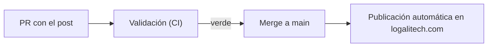

# Logali Tech — Blog

Contenido abierto del blog de **[Logali Tech](https://logalitech.com)**: notas
técnicas sobre **ABAP Cloud, S/4HANA, CDS, RAP, Fiori y BTP**, escritas desde
proyecto real. Hecho por ingenieros, para profesionales.

> 📖 **Léelo bonito en la web → [logalitech.com/blog](https://logalitech.com/blog)**

## Explora Logali Tech

- 🎓 **Cursos SAP en español** — empieza **gratis** (las 3 primeras secciones de cada curso, sin tarjeta): **[logalitech.com/pricing](https://logalitech.com/pricing)**
- 🧪 **Campus de formación** → **[training.logalitech.com](https://training.logalitech.com)**
- 📚 **Libros técnicos (ABAP Objects, CDS, RAP, S/4HANA)** — el **100% del beneficio se dona** a la ONG **[open-hand.org](https://open-hand.org)**: **[logalitech.com/books](https://logalitech.com/books)**
- 💬 **Consultoría SAP / BTP** → **[logalitech.com/consulting](https://logalitech.com/consulting)**

## Por qué este repo es abierto

Creemos en compartir conocimiento. Los artículos viven aquí, en Git, separados
del código de la web. Así cualquiera puede leerlos, proponer correcciones y ver
cómo evolucionan. Y si te sirven, en la web tienes los cursos y los libros —
cuya compra, además, financia un proyecto sin ánimo de lucro.

## Estructura

```
es/<slug>.mdx      posts en español  → logalitech.com/blog/<slug>
en/<slug>.mdx      posts en inglés   → logalitech.com/en/blog/<slug>
images/            imágenes de los posts
```

## Cómo se publica



- Cada cambio entra por **Pull Request**; el CI valida el post.
- **Merge a `main` = publicación**: la web lo detecta y despliega solo.
- Guía completa (crear posts, categorías, imágenes, diagramas Mermaid) en el repo
  del sitio: `web-frontend/docs/PROCEDIMIENTO_BLOG.md`.

## Corrígenos o propón un tema

¿Ves una errata o quieres proponer un artículo? Abre un **issue** o un **PR**.

---

© Logali Tech. El contenido se publica para su lectura; para reutilizarlo,
escríbenos.
