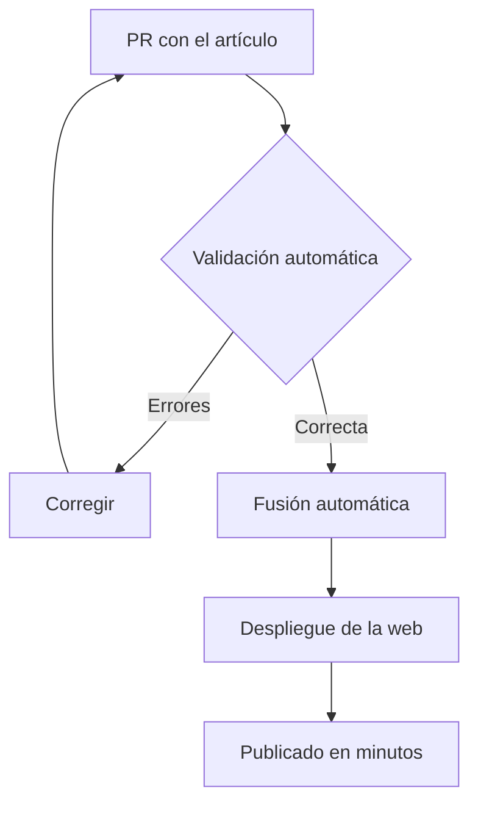

# Logali Tech: blog

Contenido abierto del blog de **[Logali Tech](https://logalitech.com)**: notas
técnicas sobre **ABAP Cloud, S/4HANA, CDS, RAP, Fiori y BTP**, escritas desde
proyecto real. Hecho por ingenieros, para profesionales.

> 📖 **Léelo en la web → [logalitech.com/blog](https://logalitech.com/blog)**

## Explora Logali Tech

- 🎓 **Cursos SAP en español**: empieza **gratis** (las 3 primeras secciones de cada curso, sin tarjeta) en **[logalitech.com/pricing](https://logalitech.com/pricing)**
- 🧪 **Campus de formación** → **[training.logalitech.com](https://training.logalitech.com)**
- 📚 **Libros técnicos (ABAP Objects, CDS, RAP, S/4HANA)**: el **100 % del beneficio se dona** a la ONG **[open-hand.org](https://open-hand.org)**. Catálogo en **[logalitech.com/books](https://logalitech.com/books)**
- 💬 **Consultoría SAP / BTP** → **[logalitech.com/consulting](https://logalitech.com/consulting)**

## Por qué este repositorio es abierto

Creemos en compartir conocimiento. Los artículos viven aquí, en Git, separados
del código de la web. Así cualquiera puede leerlos, proponer correcciones y ver
cómo evolucionan. Para profundizar, la web ofrece los cursos y los libros, cuya
compra financia además un proyecto sin ánimo de lucro.

## Estructura

```
es/<slug>.mdx        artículos en español  → logalitech.com/blog/<slug>/
en/<slug>.mdx        artículos en inglés   → logalitech.com/en/blog/<slug>/
landings/<slug>.mdx  páginas de campaña    → logalitech.com/lp/<slug>/
images/              imágenes de los artículos (se publican en /images/blog/)
categories.json      lista controlada de categorías del blog
email-assets/        recursos gráficos para correos
scripts/validate.mjs validación automática del contenido
```

## Cómo se publica


```mermaid
flowchart TB
  A["PR con el artículo"] --> B{"Validación automática"}
  B -->|"Errores"| C["Corregir"]
  C --> A
  B -->|"Correcta"| D["Fusión automática"]
  D --> E["Despliegue de la web"]
  E --> F["Publicado en minutos"]
```

- Cada cambio entra por **Pull Request**.
- La validación automática aplica las mismas reglas que la compilación de la
  web: cabecera, campos, sintaxis MDX y diagramas. Un error impide fusionar la PR.
- Con la validación en verde, las PR de contenido del equipo se **fusionan
  solas**, salvo que estén en borrador. Las PR de copias externas del
  repositorio las revisa y fusiona el equipo.
- **Fusionar en `main` equivale a publicar**: cada fusión lanza el despliegue de
  la web, y el artículo queda visible en pocos minutos. Un despliegue programado
  cada hora actúa como respaldo.

Validación en local (requiere Node.js 20 o superior):

```bash
cd scripts && npm ci && cd ..
node scripts/validate.mjs
```

## Correcciones y propuestas

Para señalar una errata o proponer un artículo, abre un **issue** o un **PR**.

---

© Logali Tech. El contenido se publica para su lectura; para reutilizarlo,
escríbenos.
