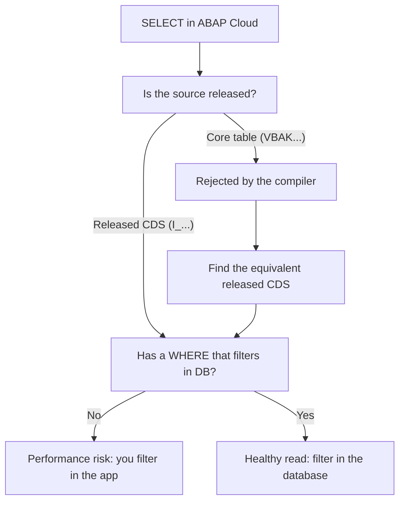

A developer coming from classic ABAP opens their first object in ABAP Cloud, writes a good old `SELECT`, and the compiler strikes it out. First reaction: "this is more restrictive". Second reaction, a few weeks later: "this is saving me from my own bad habits". Let us look at what actually changes.

## SQL does not change; what changes is what you can aim at

The `SELECT` syntax is the same you know: `result`, `FROM`, `INTO`/`APPENDING`, `WHERE`, `GROUP BY`, `HAVING`, `ORDER BY`. No surprises there. What changes is the catalog of legal sources:

- **You do not read core transparent tables directly**. `VBAK`, `MARA` and friends stop being valid doors. The door is the equivalent released CDS (`I_...`).
- **Client handling stops being your problem**. In classic you played with `CLIENT SPECIFIED` and queried the client field; in Cloud that is closed except in very specific cases and the system manages the client for you.
- **The language is restricted**: it only compiles against what SAP releases. A `SELECT` aimed at something non-released does not even pass the syntax check.

> Classic ABAP let you shoot at any table. ABAP Cloud forces you to shoot at a contract. The difference shows up three upgrades later, when your code is still alive.

## What stays the same (and still matters)

It is not all prohibitions. The timeless good practices are not only still valid, now they are almost mandatory:

- **WHERE always**. Even though it is optional in the syntax, restricting the result set in the application layer instead of the database is a performance sin. Filtering goes in the `WHERE`, not in a later `LOOP`.
- **Read into an internal table in one shot**, not row by row with `APPEND` inside a loop. A single selection more than pays back the memory cost.
- **Watch `SY-SUBRC` and `SY-DBCNT`**. They are still your source of truth: 0 there is data, 4 empty set, and `SY-DBCNT` gives you the rows read.



## Before and after, in code

This is how you filtered in classic, fetching too much and discarding in memory (bad):

```abap
" Anti-pattern: fetch everything and filter in the application
SELECT * FROM sflight INTO TABLE @DATA(lt_all).
LOOP AT lt_all INTO DATA(ls) WHERE currency = 'USD'.
  " ... process
ENDLOOP.
```

And this is how in ABAP Cloud, with the filter where it belongs and a valid source:

```abap
" The filter goes in the WHERE: the database does the work
SELECT carrid, connid, price, currency
  FROM i_flight
  WHERE currency = 'USD'
  INTO TABLE @DATA(lt_usd).

IF sy-subrc = 0.
  " sy-dbcnt gives the number of rows read
  cl_demo_output=>write( |Rows: { sy-dbcnt }| ).
ENDIF.
```

Same business result, but the second one does not drag the entire data bus to the application server and it aims at a stable contract.

## Stop seeing it as a cage

The instinctive reaction ("they are taking away my freedom") is the wrong one. What ABAP Cloud takes away is precisely the accesses that coupled you to the core and the reads that blew up in production under volume. Restricted SQL is not a punishment: it is the Clean Core check turned into a compiler.

Next post: how to wrap the legacy code you cannot rewrite yet, so you can consume it from ABAP Cloud without dragging its sins into your new layer.
