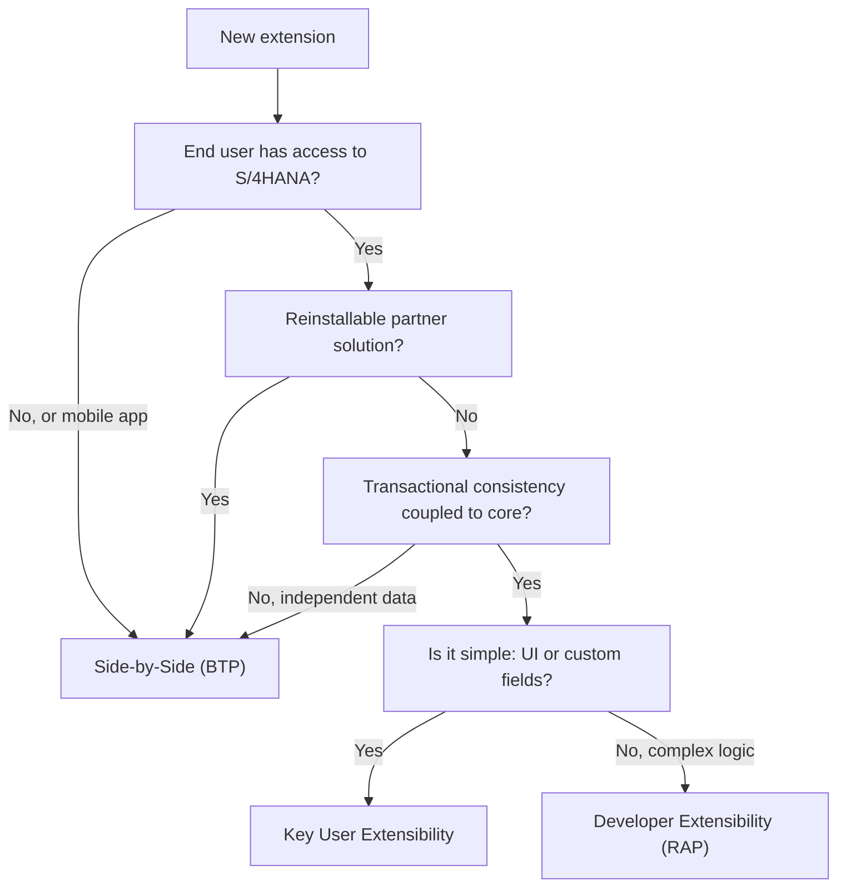

With Clean Core we hammer the "what" (extend only through stable interfaces). This post is about the "where". In S/4HANA Cloud an extension can live in three different places, and half of all maintenance pain comes from picking the wrong place without noticing there even was a choice.

## The three tiers, no jargon

SAP groups extensions into two big categories, and within them you get three working options:

- **Key User Extensibility (on stack)**: the business expert adapts the system with Fiori tools: custom fields, custom business objects, logic via BAdIs and restricted ABAP, analytical queries. No Eclipse, no classic transports.
- **Developer Extensibility (on stack)**: the developer extends inside the ABAP stack from Eclipse ADT, using RAP, released CDS, released APIs and BAdI extension points. This is pure ABAP for Cloud Development.
- **Side-by-Side (BTP)**: the code runs in parallel on the Business Technology Platform, using RAP or CAP, and talks to S/4HANA only through APIs. It never touches the core ABAP stack.

Underneath all of this, keep the ABAP tiers SAP defines clear in your head:

- **Tier 1, ABAP for Cloud Development**: the cloudready model, the only one that survives upgrades clean.
- **Tier 2, APIs from classic ABAP**: expose on-premise functionality to the cloud in a controlled way.
- **Tier 3, classic ABAP**: deep modifications in the core. Powerful and dangerous, being phased out.

## The hierarchy matters (and almost nobody respects it)

SAP does not put these options on the same level. There is a priority order, and it is a recommendation with technical consequences:

1. First **Key User**. If a business expert can solve it with Fiori, do not send in a developer.
2. Then **Developer**. If the logic is complex but belongs to the core, it goes in the stack with RAP.
3. Last **Side-by-Side**, which depends on the scenario: apps for users without S/4HANA access, reinstallable partner solutions, or workloads independent of the infrastructure.

> The question is not "how do I code this", but "who should code it and where". When that question gets skipped, code ends up in Tier 3 by inertia and the upgrade sends the bill.

## The decision tree, in short



## A Developer Extensibility example

When it lands in Tier 1 with business logic, the pattern is a class implementing a released BAdI interface, not a modification of the standard:

```abap
CLASS zcl_check_credit_limit DEFINITION
  PUBLIC
  FINAL
  CREATE PUBLIC.
  PUBLIC SECTION.
    " The extension point is a BAdI released by SAP
    INTERFACES if_badi_sales_order_check.
ENDCLASS.

CLASS zcl_check_credit_limit IMPLEMENTATION.
  METHOD if_badi_sales_order_check~validate.
    " Only released CDS and APIs are consumed: no SELECT on VBAK
    SELECT SINGLE credit_limit
      FROM i_customercreditlimit          "#EC released CDS
      WHERE customer = @iv_customer
      INTO @DATA(lv_limit).

    IF iv_net_amount > lv_limit.
      APPEND VALUE #( type = 'E' text = 'Credit limit exceeded' )
        TO et_messages.
    ENDIF.
  ENDMETHOD.
ENDCLASS.
```

Notice: this is Developer Extensibility (complex logic, in the core) but it respects Tier 1 (released CDS only, stable extension point). Tier and discipline are two different things and both matter.

## The mistake you pay at upgrade time

The typical failure is not technical, it is framing: someone solves with Developer Extensibility something a key user would have done in twenty minutes, or drops into the core logic that was a perfect Side-by-Side candidate. It works on demo day. On upgrade day, every mis-chosen tier is a line in the regression queue.

Next post: how to tell, cold, whether the class or CDS you are about to call is actually released (the usage list and the release state), because that is what keeps your Developer Extensibility Clean Core.
