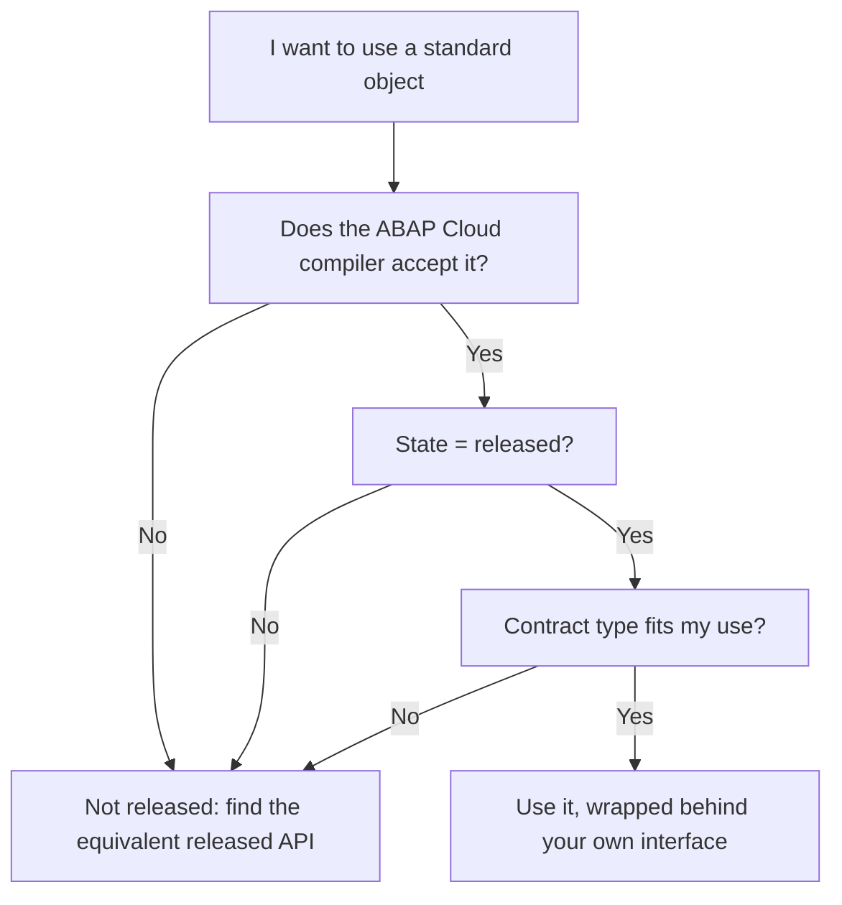

We have already said that in Clean Core you only consume released objects. That sounds easy until you are staring at a `CL_...` class that does exactly what you need and you have no idea whether you are allowed to touch it. This post is about that specific check, the one that separates a guess from a certainty.

## "It exists" is not "it is released"

In a classic on-premise system you could call almost anything that compiled. In ABAP for Cloud Development that is over: the language is restricted and you only see the objects SAP has marked as usable. An object showing up does not mean it is released for your scenario. Release is a contract with three pieces:

- **The release state**: released or not released. Without release, you are outside the contract.
- **The contract type**: what use SAP releases it for. "Use system-internally" is not the same as "use as remote API".
- **The guaranteed stability**: SAP commits to not breaking the signature of released objects between releases. For non-released ones it promises nothing.

## How you actually check

Do not guess from the name prefix. Check. In ADT you have three paths that complement each other:

1. **The ABAP Cloud compiler itself**: if you write against something non-released, the restricted-language syntax check flags it instantly. That is your first net.
2. **The object's release contract**: in the object properties (or its header) you see whether it is released and with what contract type. That is where you decide whether your use fits.
3. **The usage list (where-used)**: it tells you who consumes that object. Useful for the reverse path: if you are about to extend something, know who depends on it before you touch it.

> "It compiles" is not "it is released", and "it is released" is not "released for what I want". Three separate doors, and you have to pass all three.



## One example that fails and one that passes

The first compiles on-premise and blows up in ABAP Cloud, because `VBAK` is not an object released for direct access:

```abap
" NOT released in ABAP for Cloud Development: the compiler rejects it
SELECT SINGLE * FROM vbak
  WHERE vbeln = @iv_order
  INTO @DATA(ls_header).
```

The second uses the equivalent released CDS, which is a stable contract:

```abap
" Released as CDS: stable contract across upgrades
SELECT SINGLE salesorder, soldtoparty, totalnetamount
  FROM i_salesorder
  WHERE salesorder = @iv_order
  INTO @DATA(ls_header).
```

The difference is not stylistic: the first can break in any feature pack without warning and the second cannot.

## The habit that saves you the rework

Before typing the name of any standard object, stop and answer three questions: is it released, with what contract type, and does it fit what I am about to do. Thirty seconds. If the answer to any is "no", a released API equivalent almost always exists; and if one genuinely does not, that is your legitimate case to document an exception, not to skip the contract in silence.

Next post we drill into ABAP SQL in ABAP Cloud: what changes versus classic when the language stops letting you do what you used to do without thinking.
