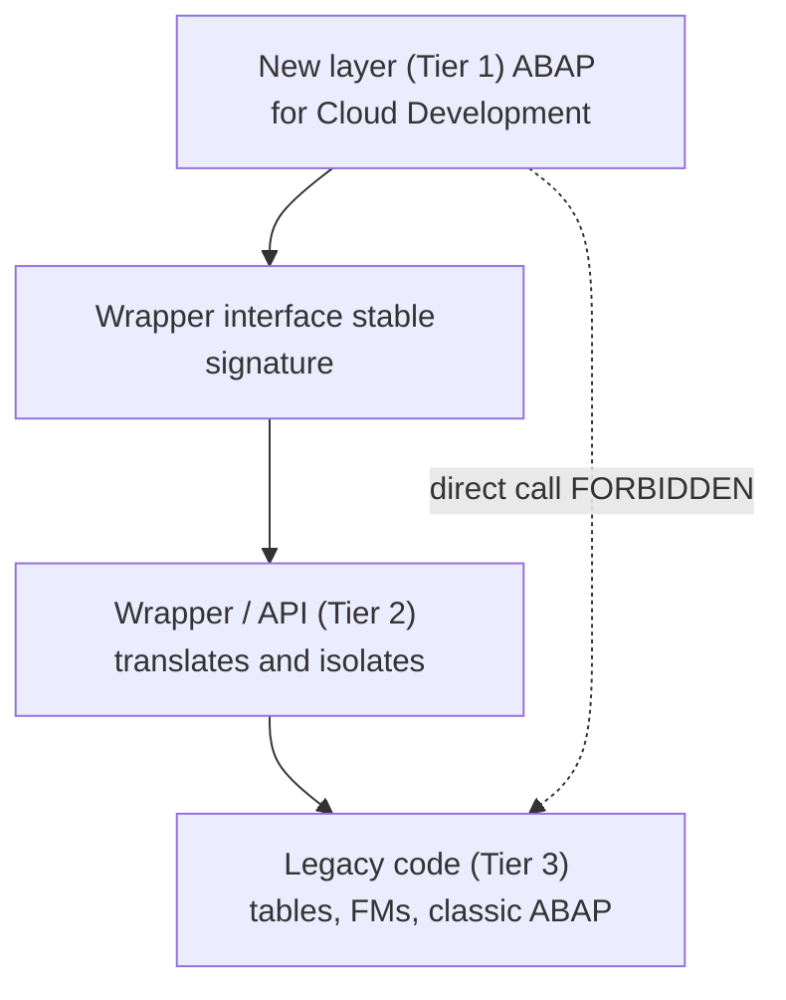

No real project starts on a green field. You have a base of classic ABAP that works, that nobody is rewriting this quarter, and at the same time you must build the new layer in ABAP Cloud. The temptation is either to tear it all down (impossible) or to call the legacy directly from the new code (poison). There is a third way, and it has a name: wrappers.

## The problem in one sentence

Classic code uses things that do not exist in ABAP Cloud: direct table access, non-released function modules, unrestricted language statements. If you call it bare from your cloud layer, you drag all of that into your new code and the first thing that happens is it does not even compile. And even if it compiled through some bridge, you would have coupled your clean layer to the most fragile part of the system.

## The ABAP tiers give you the hint

SAP already defined how old and new coexist, and it fits here:

- **Tier 1, ABAP for Cloud Development**: your new, clean, cloudready layer.
- **Tier 2, APIs from classic ABAP**: the bridge. You expose legacy functionality as a stable, controlled API.
- **Tier 3, classic ABAP**: the old code, which stays where it is, untouched.

The wrapper strategy is, neither more nor less, materializing Tier 2: wrapping Tier 3 behind an interface that Tier 1 can consume without ever knowing what is behind it.

> A well-made wrapper is a promise: "I promise my new layer only knows this signature, and the day I rewrite what is inside, nobody notices."



## The pattern, in two pieces

First, the interface: it is the only contract your cloud layer knows. No legacy types peeking through here, only clean types from your domain.

```abap
INTERFACE zif_customer_credit
  PUBLIC.
  TYPES: BEGIN OF ty_credit,
           customer     TYPE i_customer-customer,
           credit_limit TYPE p LENGTH 15 DECIMALS 2,
         END OF ty_credit.

  METHODS get_credit
    IMPORTING iv_customer      TYPE i_customer-customer
    RETURNING VALUE(rs_credit) TYPE ty_credit.
ENDINTERFACE.
```

Second, the wrapper implementation: here, and only here, lives the contact with the old. If tomorrow that calculation moves to a released API, you change this class and nobody else notices.

```abap
CLASS zcl_customer_credit DEFINITION
  PUBLIC FINAL CREATE PUBLIC.
  PUBLIC SECTION.
    INTERFACES zif_customer_credit.
ENDCLASS.

CLASS zcl_customer_credit IMPLEMENTATION.
  METHOD zif_customer_credit~get_credit.
    " Legacy access is ISOLATED behind this signature.
    " Today via a remote API / released RFC; tomorrow whatever.
    DATA(lo_legacy) = NEW zcl_legacy_credit_facade( ).
    rs_credit = VALUE #(
      customer     = iv_customer
      credit_limit = lo_legacy->read_limit( iv_customer ) ).
  ENDMETHOD.
ENDCLASS.
```

Notice what is NOT in the new layer: no `SELECT` on a classic table, no `CALL FUNCTION` to a non-released module. All of that lives behind `zcl_legacy_credit_facade`, in a single point.

## The rules that make this work

- **A single door**. The legacy is touched in one place per domain. If a second place appears, the wrapper has failed.
- **Your domain types in the signature**, not legacy structures. The interface must not give away what is behind it.
- **Errors are translated**. A `sy-subrc` or a technical legacy message becomes your domain error before crossing the boundary.
- **The wrapper is disposable on purpose**. Its value is being able to throw it away the day the released API exists, without touching its consumers.

## What you gain

With this layer, migration stops being a big bang and becomes incremental: you rewrite the inside of a wrapper when it makes sense, not when the whole project demands it. Your cloud layer is born clean from day one, even though twenty years of classic ABAP still beat underneath. That is, in practice, how you do Clean Core in a system that did not start clean.

With this we close the ABAP Cloud series: from the extensibility model to the release check, from restricted SQL to living with the legacy. The common thread is always the same: extend through contracts, not through coupling.
