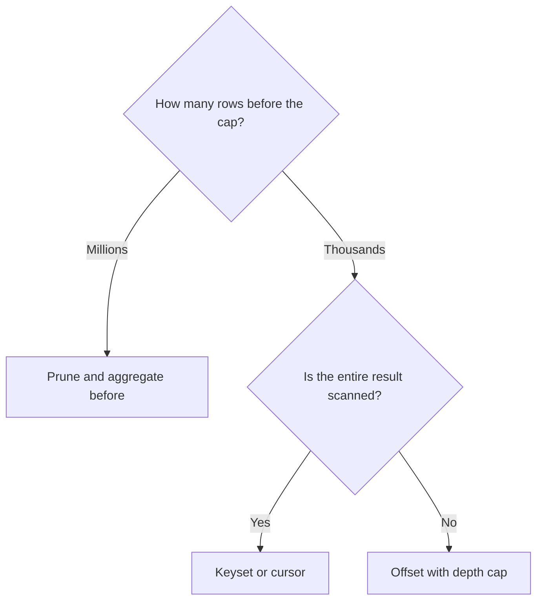

A result of two million rows is not delivered all at once: it is delivered in pages. The way you ask the database for page number N determines the cost, and the difference between the two usual techniques is not noticeable on page three. On page five hundred, it is.

This article compares both techniques with measurements in a lab of our own (SAP S/4HANA 2025 on SAP HANA 2.0 SPS 08, with synthetic data), sets out the requirements of each one and ends with a criterion for choosing by scenario.

## Offset: requesting from a position

It is the most widespread technique and the one applied by consumption protocols when their skip and top parameters are used (`$skip` and `$top` in OData).

```abap
" 1,000-row page starting at position lv_offset
SELECT rbukrs, belnr, docln
  FROM zcdsa_glitem
  WHERE rldnr = '0L' AND gjahr = '2025'
  ORDER BY rbukrs, belnr, docln
  INTO TABLE @lt_page
  UP TO 1000 ROWS
  OFFSET @lv_offset.
```

The statement reads as "one thousand rows starting from the indicated position." To fulfill it, the engine needs to know which row is number five hundred thousand in that order, and to do so **it produces the five hundred thousand preceding rows and discards them**. The discarded work grows with the depth of the page, so traversing the entire result page by page has a cost that grows with the square of the number of pages.

ABAP SQL requires `ORDER BY` to use `OFFSET`, and SAP documentation warns that, if the order is not unique, it is not possible to determine which rows make up the result. An order that ends in the full key is the first condition of any pagination.

## Keyset: request from the last delivered key

The alternative does not use positions, but the value of the key by which the data is sorted. `keyset` is not a language keyword: no clause with that name exists in either ABAP SQL or HANA SQL. It is the name of a pattern, which technical literature also calls key pagination or the *seek method*. Everything the code contains is a `WHERE` written in a specific way plus a row limit.

```abap
" Next page after the last key delivered (ls_last)
SELECT rbukrs, belnr, docln
  FROM zcdsa_glitem
  WHERE rldnr = '0L' AND gjahr = '2025'
    AND (    rbukrs > @ls_last-rbukrs
          OR ( rbukrs = @ls_last-rbukrs AND belnr > @ls_last-belnr )
          OR ( rbukrs = @ls_last-rbukrs AND belnr = @ls_last-belnr
               AND docln > @ls_last-docln ) )
  ORDER BY rbukrs, belnr, docln
  INTO TABLE @lt_page
  UP TO 1000 ROWS.
```

The cascade of conditions expresses a single idea: everything that comes after this key, in this order. It is written this way because the sort key has three fields and the comparison is lexicographic: first the first field; if it matches, the second; if that also matches, the third.

The rows before the page are not produced and then discarded: they are excluded by the filter itself. That is why the cost of a page does not depend on its depth.

> **The cascade of `OR` is not an OR join.** It looks the same as the `OR` antipattern in a join condition, but it is in the `WHERE`, it acts on a single table and it follows a total order. There is no matching to resolve. The structure of the construct matters more than the operator that appears in it.

## The measured curve: offset vs keyset

Measurement conditions:

- Lab journal table, ledger `0L` and fiscal year 2025: about 2.4 million rows.
- Pages of 1,000 rows and four depths: 0, 100,000, 500,000 and 2,000,000 rows skipped.
- Three runs per point after a warm-up one, launched from an ABAP test class under the same conditions for both variants. The average is published.

| Rows skipped | Offset | Keyset |
|---|---|---|
| 0 | 32 ms | 26 ms |
| 100,000 | 1,146 ms | 36 ms |
| 500,000 | 3,786 ms | 32 ms |
| 2,000,000 | 2,013 ms | 15 ms |


The keyset column is **flat**: between 15 and 36 milliseconds, with no relation to depth. The offset column **grows with depth**: with 100,000 rows skipped, a page costs about 36 times what the first one cost; with 500,000, more than 100 times.

Traversing the full result by keyset takes about 2,400 pages of constant cost. By offset, each page costs what the curve indicates at its depth, and the sum of all of them grows with the square of the number of pages.

### The anomalous point

The two million point by offset measured less than the five hundred thousand one, an inversion that contradicts the trend. The explanation consistent with the lab lies in partitioning: the table is hash partitioned into four partitions by company code, of very different sizes, and the query order starts with that same column. At different depths, the rows the engine produces and discards come from different partitions, and the execution plan need not be the same.

The practical conclusion does not change, and neither does the method: the full curve is published, with its anomalies, and the decision is made based on its shape, not on an isolated point. A measurement that only shows the points that confirm the thesis does not allow you to decide.

> **To reproduce it.** It is advisable to measure from a program or a test class, not from the ADT SQL console: in the lab, the console rejected `UP TO ... OFFSET` behind `ORDER BY` and ignored it behind `FROM`, so the offset side cannot be measured there reliably. The general measurement method is described in [Analyzing performance in HANA](/en/blog/hana-analisis-rendimiento/).

## What the keyset requires

Neither of the two techniques is free. The keyset achieves constant cost in exchange for three requirements:

1. **A total, stable order that ends in a unique key.** If two rows can match on all the fields of the `ORDER BY`, pagination can skip rows or repeat them at the boundary between pages. When sorting by date, breaking ties with the document key is mandatory.
2. **State.** Someone has to remember the last key delivered: the program, the client, or a token included in the link to the next page.
3. **Giving up random access.** Going to page 4,512 is no longer a natural operation, because there are no positions, only keys.

## OData: nextLink does not guarantee keyset

In OData, `$top` and `$skip` are position-based pagination by definition: the client requests a position. SAPUI5's OData V4 model calculates both parameters automatically based on the row range requested by the control, so a Fiori table paginates by offset. This is a suitable choice, because the user of an on-screen table rarely goes beyond the first few pages.

Server-driven pagination is different. The service returns a partial result with a `@odata.nextLink`, and the protocol reserves the `$skiptoken` option for building that link. The content of the token is decided by the service and is opaque to the client: it can be a position, with the cost curve of offset, or the last key delivered, with that of keyset. Before basing a mass export on the `nextLink`, it is worth checking how the specific service builds it. The most direct test is to compare the response time of the last pages with that of the first ones.

## ABAP cursor for batch processes

For a batch process that loops over a large set inside the application server, the third option is a database cursor: a single statement whose result is consumed in packages.

```abap
TYPES: BEGIN OF ty_line,
         accountingdocument TYPE i_journalentryitem-accountingdocument,
         ledgergllineitem   TYPE i_journalentryitem-ledgergllineitem,
         glaccount          TYPE i_journalentryitem-glaccount,
         amount             TYPE i_journalentryitem-amountincompanycodecurrency,
       END OF ty_line.
DATA lt_batch TYPE STANDARD TABLE OF ty_line WITH EMPTY KEY.

OPEN CURSOR @DATA(dbcur) FOR
  SELECT AccountingDocument, LedgerGLLineItem, GLAccount,
         AmountInCompanyCodeCurrency
    FROM I_JournalEntryItem
    WHERE Ledger = '0L' AND CompanyCode = '1010' AND FiscalYear = '2025'
    ORDER BY AccountingDocument, LedgerGLLineItem.

DO.
  " FETCH does not support inline declarations: the table is declared beforehand
  FETCH NEXT CURSOR @dbcur INTO TABLE @lt_batch PACKAGE SIZE 5000.
  IF sy-subrc <> 0.
    EXIT.
  ENDIF.
  " Process the package
ENDDO.
CLOSE CURSOR @dbcur.
```

Packages of 1,000 to 10,000 rows keep memory under control. The cursor keeps the result open in the database for the duration of the loop, so it is reserved for batch processes and is not used in interactive sessions. The documentation recommends always closing it explicitly with `CLOSE CURSOR`.

## Selection criteria

| Scenario | Technique |
|---|---|
| Table on screen, where the user rarely goes past the first pages | Offset |
| Search with a jump to a specific page | Offset, with filters that reduce the set and an explicit depth cap |
| Full export to a file | Keyset or cursor |
| Integration that downloads increments | Keyset, with the timestamp as part of the token |
| Batch process over a large table | Cursor with packages of 1,000 to 10,000 rows |
| Analytical report with navigation | First, filters that reduce the set; then, either of the two |

The same decision, in the form of a tree:



## The rule that sits above both

**If the row cap arrives after grouping millions of rows, the problem is not pagination: it is the model.** A report that groups a full fiscal year, sorts the result and then keeps the first rows does not have a pagination problem. The cap is applied once the expensive work has already been done and prevents no cost at all. The fix is to filter and aggregate earlier, in the data layer: the [code-to-data](/en/blog/hana-code-to-data/) principle applied to view design. Filters that reach the view early, for example through [typed parameters](/en/blog/cds-parametros/), reduce the set before any pagination.

## Summary

1. Offset produces and discards everything it skips, so its cost grows with page depth. In the lab it went from 32 ms on the first page to 3,786 ms with 500,000 rows skipped.
2. Keyset filters by the last key delivered, so its cost does not depend on depth. In the same measurement it stayed between 15 and 36 ms.
3. Keyset requires a total order ending in a unique key, a state that remembers the last key, and giving up random access.
4. In OData, `$skip` is offset; a `nextLink` with `$skiptoken` can be either technique, depending on the service.
5. The anomalies of a curve are published and explained; they are not trimmed.
6. No pagination technique fixes a model that materializes millions of rows before discarding them.

Designing CDS views for large volumes is covered with guided exercises in the course [SAP ABAP Cloud CDS: Core Data Services](/courses/sap-abap-cloud-cds-core-data-services/) and in the book [ABAP Cloud: Data Modeling with CDS](/books/abap-cds/).
