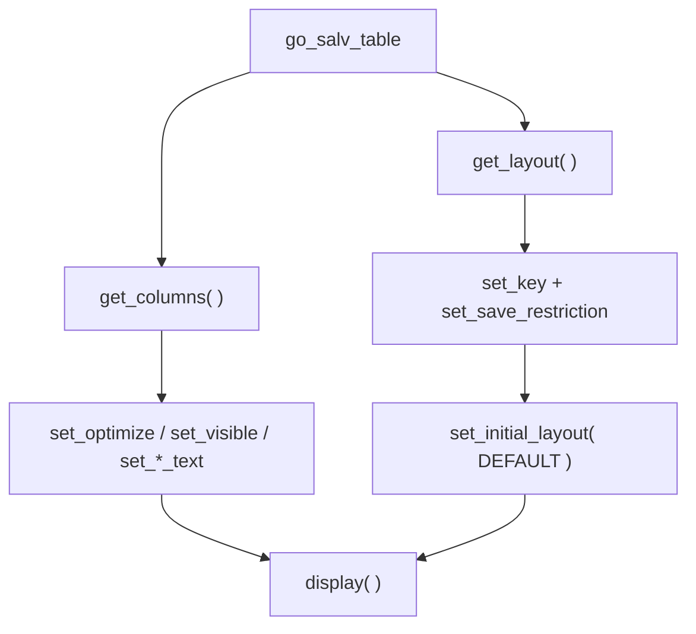

Under every ALV there are three things that decide whether the list is usable: **which columns show and what they are called** (catalog), **how it is presented** (layout) and **whether the user can save their view** (variants). With the classic family these were flat structures filled in by hand. With SALV they are objects you ask the ALV for and talk to. The difference shows.

## Columns: ask for the object and configure

In `CL_SALV_TABLE`, the columns are a `cl_salv_columns_table` object. You optimize widths, hide technical columns and rename, all with clear methods and exception handling if the column does not exist.

```abap
FORM change_salv_columns.
  DATA: lo_columns    TYPE REF TO cl_salv_columns_table,
        lo_sng_column TYPE REF TO cl_salv_column.

  lo_columns = go_salv_table->get_columns( ).
  lo_columns->set_optimize( abap_true ).

  TRY.
      lo_sng_column = lo_columns->get_column( columnname = 'MANDT' ).
      lo_sng_column->set_visible( if_salv_c_bool_sap=>false ).
    CATCH cx_salv_not_found.
  ENDTRY.

  TRY.
      lo_sng_column = lo_columns->get_column( columnname = 'MATRICULA' ).
      lo_sng_column->set_long_text(   'Plate No.' ).
      lo_sng_column->set_medium_text( 'Plate No.' ).
      lo_sng_column->set_short_text(  'Plate No.' ).
    CATCH cx_salv_not_found.
  ENDTRY.
ENDFORM.
```

`set_optimize` fits widths to the content; `set_visible( false )` hides `MANDT` and the technical flags; the three `set_*_text` calls cover the three header lengths SAP uses depending on the available width. No looping over an `lvc_t_fcat` by hand.



## Layout and variants: let the user save their view

A variant is the view the user configures (columns, order, filters) and expects to find again. In SALV it is managed with `cl_salv_layout`: you define a save key, authorize saving and optionally load a default variant.

```abap
FORM change_salv_layout.
  DATA: lo_salv_layout TYPE REF TO cl_salv_layout,
        ls_key         TYPE salv_s_layout_key,
        lv_variant     TYPE slis_vari.

  lo_salv_layout = go_salv_table->get_layout( ).

  ls_key-report        = sy-repid.
  ls_key-logical_group = 'ALQ'.
  lo_salv_layout->set_key( ls_key ).

  lo_salv_layout->set_save_restriction( if_salv_c_layout=>restrict_none ).

  lv_variant = 'DEFAULT'.
  lo_salv_layout->set_initial_layout( lv_variant ).
ENDFORM.
```

Three decisions that matter:

- **`set_key`** ties the variants to this program and a logical group (`ALQ`), so the same report can have different sets of variants per context.
- **`set_save_restriction( restrict_none )`** allows saving user and global variants; there are stricter values if you do not want each user to create their own.
- **`set_initial_layout`** starts the ALV already showing the `DEFAULT` view, without the user having to select it.

## The classic pitfall of the generated catalog

When you work with ALV Grid instead of SALV, the catalog is usually generated with `LVC_FIELDCATALOG_MERGE` from a dictionary structure, and then tweaked field by field:

```abap
CALL FUNCTION 'LVC_FIELDCATALOG_MERGE'
  EXPORTING
    i_structure_name = 'ZCO_VEHICULOS'
  CHANGING
    ct_fieldcat      = gt_fieldcat
  EXCEPTIONS
    OTHERS           = 3.

LOOP AT gt_fieldcat ASSIGNING <ls_fieldcat>.
  CASE <ls_fieldcat>-fieldname.
    WHEN 'MARCA'.     <ls_fieldcat>-f4availabl = abap_true.
    WHEN 'MATRICULA'. <ls_fieldcat>-hotspot    = abap_true.
  ENDCASE.
ENDLOOP.
```

It works, but it is exactly the kind of flat code SALV saves you. Generate and tweak, generate and tweak; and every new field in the structure is another `WHEN` you forget.

> The catalog is not a presentation detail: it is the contract between your data and what the user sees. In SALV that contract is typed code; in the classic version, a structure you have to babysit.

That closes the ALV series. The thread has always been the same: `CL_SALV_TABLE` as the modern standard for lists, `CL_GUI_ALV_GRID` when you truly need to edit, and in both cases, objects and events instead of flat structures and callbacks.
