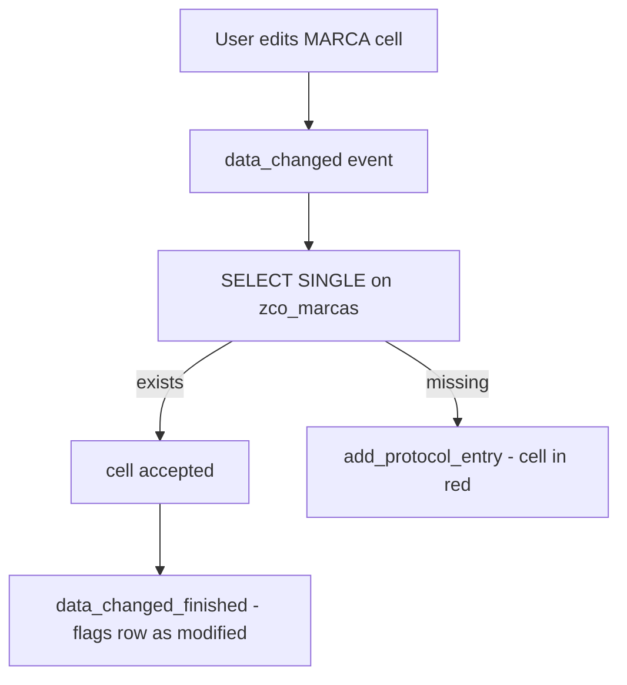

This is where `CL_SALV_TABLE` falls short and you drop down to `CL_GUI_ALV_GRID`. An editable ALV is not just putting cells in write mode: it is **validating what the user types, offering value helps and persisting only what is correct**. And all of that runs through events. Let us go to the real pattern.

## Validate on the fly: the data_changed event

Every time the user modifies a cell, the grid fires `data_changed`. There you loop over the changed cells (`mt_good_cells`), read the value and decide whether it is valid. If it is not, you do not throw a dump: you register the error in the ALV's own protocol.

```abap
METHOD handle_data_changed.
  DATA: ls_data_changed TYPE lvc_s_modi,
        lv_marca        TYPE zlo_marca.

  LOOP AT er_data_changed->mt_good_cells INTO ls_data_changed.
    CASE ls_data_changed-fieldname.
      WHEN 'MARCA'.
        er_data_changed->get_cell_value(
          EXPORTING
            i_row_id    = ls_data_changed-row_id
            i_fieldname = ls_data_changed-fieldname
          IMPORTING
            e_value     = lv_marca ).

        SELECT SINGLE marca FROM zco_marcas
          INTO lv_marca
          WHERE marca EQ lv_marca.
        IF sy-subrc NE 0.
          er_data_changed->add_protocol_entry(
            EXPORTING
              i_msgid     = 'ZCO_MSG'
              i_msgty     = 'E'
              i_msgno     = '000'
              i_msgv1     = text-m01
              i_msgv2     = lv_marca
              i_fieldname = ls_data_changed-fieldname
              i_row_id    = ls_data_changed-row_id ).
        ENDIF.
    ENDCASE.
  ENDLOOP.
ENDMETHOD.
```

`add_protocol_entry` is the key piece: it flags the cell in red and shows the message in the ALV's standard protocol, without pulling the user out of context. The brand does not exist in `zco_marcas` -> visible error, edit not confirmed.



## Custom value help: the onf4 event

For editable cells it pays to offer a tailored F4. You declare the column with `f4availabl = abap_true` in the catalog and implement `onf4`, which fills the values and returns them to the grid via `er_event_data`:

```abap
METHOD handle_onf4.
  DATA: lt_marcas     TYPE TABLE OF zco_marcas,
        lt_return_tab TYPE TABLE OF ddshretval,
        ls_return_tab TYPE ddshretval,
        ls_modify_data TYPE lvc_s_modi.
  FIELD-SYMBOLS <lt_modify_data> TYPE lvc_t_modi.

  CASE e_fieldname.
    WHEN 'MARCA'.
      SELECT marca FROM zco_marcas INTO TABLE lt_marcas WHERE marca NE space.
      CALL FUNCTION 'F4IF_INT_TABLE_VALUE_REQUEST'
        EXPORTING
          retfield    = 'MARCA'
          dynpprog    = sy-repid
          dynpnr      = sy-dynnr
          dynprofield = 'MARCA'
          value_org   = 'S'
        TABLES
          value_tab   = lt_marcas
          return_tab  = lt_return_tab.
      READ TABLE lt_return_tab INTO ls_return_tab INDEX 1.
      IF sy-subrc EQ 0.
        ls_modify_data-row_id    = es_row_no-row_id.
        ls_modify_data-fieldname = e_fieldname.
        ls_modify_data-value     = ls_return_tab-fieldval.
        ASSIGN er_event_data->m_data->* TO <lt_modify_data>.
        APPEND ls_modify_data TO <lt_modify_data>.
      ENDIF.
  ENDCASE.
  er_event_data->m_event_handled = abap_true.
ENDMETHOD.
```

Do not forget `er_event_data->m_event_handled = abap_true`: it tells the grid you have handled the F4 and it should not apply the standard one.

## Persist only what is good

You flag the touched rows in `data_changed_finished` (with your own flag, here `bbdd`), and on "Save" you loop over only those and run `MODIFY`:

```abap
WHEN 'A_SAVE'.
  LOOP AT gt_vehiculos INTO ls_vehiculos WHERE bbdd EQ abap_true.
    MOVE-CORRESPONDING ls_vehiculos TO ls_bbdd_vehiculos.
    APPEND ls_bbdd_vehiculos TO lt_bbdd_vehiculos.
  ENDLOOP.
  IF sy-subrc EQ 0.
    MODIFY zco_vehiculos FROM TABLE lt_bbdd_vehiculos.
    IF sy-subrc EQ 0.
      MESSAGE s001(zco_msg).
    ENDIF.
  ENDIF.
```

> An editable ALV without validation in data_changed is not a convenience: it is a direct route to shoving garbage into the database.

Next post we close the series with what holds all of this up: the field catalog, the layout and the variants the user saves and expects to find again.
