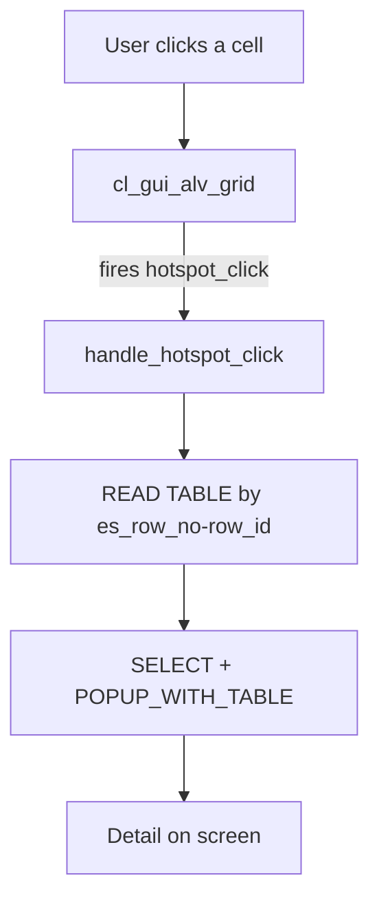

A list you only look at is half the job. The other half is responding to the click: navigating to a detail, opening a popup, triggering an action. In ALV Grid that is done with **events and handlers**, not with subroutines wired by name. And that is exactly why the object-oriented model wins.

## The pattern: receiver class + SET HANDLER

Interaction in `CL_GUI_ALV_GRID` always follows the same scheme: a local class declares methods `FOR EVENT ... OF cl_gui_alv_grid`, and you bind that class to the grid with `SET HANDLER`.

```abap
CLASS lcl_event_receiver DEFINITION.
  PUBLIC SECTION.
    METHODS handle_hotspot_click FOR EVENT hotspot_click
      OF cl_gui_alv_grid
      IMPORTING e_column_id
                e_row_id
                es_row_no.

    METHODS handle_double_click FOR EVENT double_click
      OF cl_gui_alv_grid
      IMPORTING e_column
                e_row
                es_row_no.
ENDCLASS.
```

Each event hands you, in `IMPORTING`, exactly what you need: the clicked column, the row number, the line identifier. No reading global variables to find out where the user clicked.

## Binding the handlers

Once the receiver instance is created, `SET HANDLER` connects each method to the specific grid. It is done once, when the grid already exists.

```abap
FORM set_handlers .
  IF go_event_receiver IS NOT BOUND.
    CREATE OBJECT go_event_receiver.
    SET HANDLER:
      go_event_receiver->handle_hotspot_click FOR go_alv_grid,
      go_event_receiver->handle_double_click  FOR go_alv_grid,
      go_event_receiver->handle_user_command  FOR go_alv_grid.
  ENDIF.
ENDFORM.
```



## A useful hotspot: from row to detail

The hotspot turns a cell into a link. It is flagged in the field catalog (`hotspot = abap_true`) and the event does the rest. Here, clicking a vehicle's plate, we look up its client contract and show it in a popup:

```abap
METHOD handle_hotspot_click.
  DATA: lt_clientes  TYPE STANDARD TABLE OF zco_clientes,
        ls_vehiculos TYPE gty_vehiculos.

  CASE e_column_id.
    WHEN 'MATRICULA'.
      READ TABLE gt_vehiculos INTO ls_vehiculos INDEX es_row_no-row_id.
      IF sy-subrc EQ 0.
        SELECT * FROM zco_clientes
          INTO TABLE lt_clientes
          WHERE matricula EQ ls_vehiculos-matricula
            AND cntr_type EQ 'C'.
        IF sy-subrc EQ 0.
          CALL FUNCTION 'POPUP_WITH_TABLE'
            EXPORTING
              endpos_col   = 160
              endpos_row   = 15
              startpos_col = 20
              startpos_row = 10
              titletext    = text-p01
            TABLES
              valuetab     = lt_clientes
            EXCEPTIONS
              break_off    = 1
              OTHERS       = 2.
        ELSE.
          MESSAGE s002(zco_msg) DISPLAY LIKE 'E'.
        ENDIF.
      ENDIF.
  ENDCASE.
ENDMETHOD.
```

The `es_row_no-row_id` gives you the exact row; the `READ TABLE ... INDEX` retrieves the record; and from there it is ordinary business logic. Double-click works the same way, but it receives `e_column` and `e_row` instead of the `*_id` fields.

## The detail that saves debugging sessions

A bound handler that never fires almost always has the same cause: the `SET HANDLER` ran before the grid existed, or it registered for the wrong instance. The event is tied to a concrete object (`FOR go_alv_grid`), not to the class in the abstract.

> Events are not magic: they are a typed contract between the control and your code. Respect the contract and interaction becomes trivial.

Next post: the toolbar and custom functions, so the user gets buttons that do what your business actually needs.
