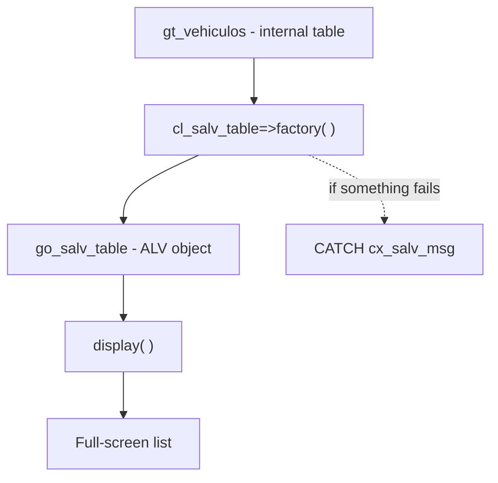

There is a test that separates well-designed APIs from the rest: **how much code you need for the simplest case**. With `CL_SALV_TABLE`, showing an internal table on screen is literally two calls. No field catalog, no callbacks, no endless parameters.

## The absolute minimum

You have your data in an internal table. You want to see it. This is all:

```abap
FORM instance_salv.
  DATA lx_salv_msg TYPE REF TO cx_salv_msg.
  TRY.
      cl_salv_table=>factory(
        IMPORTING
          r_salv_table = go_salv_table
        CHANGING
          t_table      = gt_vehiculos ).
    CATCH cx_salv_msg INTO lx_salv_msg.
      WRITE lx_salv_msg->get_text( ).
  ENDTRY.
ENDFORM.

FORM display_salv.
  go_salv_table->display( ).
ENDFORM.
```

With one reference declared in the TOP, `DATA go_salv_table TYPE REF TO cl_salv_table`, you already have a complete ALV: columns derived from the dictionary, sorting, filtering, spreadsheet export and the full standard toolbar, without writing a single line of configuration.

## What `factory` does for you

The static method `factory` is the heart of it. It takes the table in `CHANGING` (by reference, not a copy) and returns the ALV object in `r_salv_table`. From there, everything is asked of the object.



Notice the `TRY ... CATCH cx_salv_msg`: it is not decoration. `factory` can fail (for example, if the table is not suitable) and it reports that with a class exception, not with a `sy-subrc` you forget to check. That alone is a robustness improvement over the REUSE_ALV family.

## From full screen to container

The same `factory` serves to embed the ALV in a screen control. Only one parameter changes: you pass it the container.

```abap
cl_salv_table=>factory(
  EXPORTING
    r_container  = go_custom_container
  IMPORTING
    r_salv_table = go_salv_table
  CHANGING
    t_table      = gt_vehiculos ).
```

Without `r_container` you get full screen; with it, the list lives inside your `CL_GUI_CUSTOM_CONTAINER` (for example, in the bottom half of a splitter). The API is the same; you only decide where it is painted.

## Why this matters

- **Less error surface**: there is no manual catalog to drift out of sync with the structure.
- **Cheap change**: adding a column to the table adds it to the ALV, for free.
- **Readable**: whoever reads the code in two years understands `factory` and `display` without a manual.

> If your read-only list needs more than fifteen lines of plumbing, you are probably using the wrong API.

Next post we jump to interaction: events and hotspots, when the user stops looking and starts clicking.
