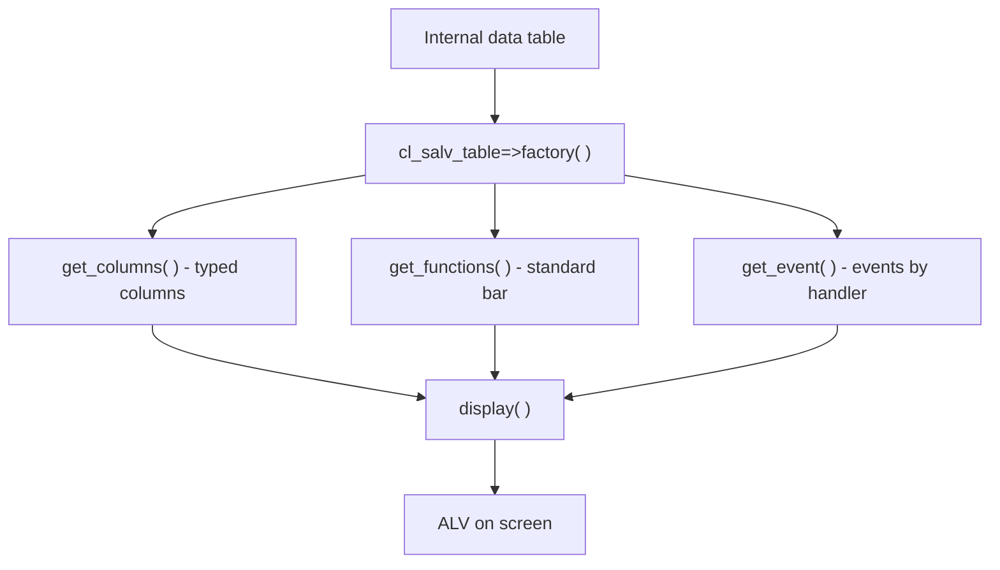

Almost every classic reporting program in SAP ends up painting a table. And for twenty years the answer was the same: `REUSE_ALV_GRID_DISPLAY` or `REUSE_ALV_LIST_DISPLAY`. They work, everyone knows them by heart, and they are in every project. The problem is not that they fail: it is that **they make you carry the weight of the model yourself**.

## The hidden cost of the REUSE_ALV family

Look at what you must prepare before a single line shows up on screen with the classic function: a field catalog filled in by hand, field by field.

```abap
FORM build_field_cat .
  DATA ls_fieldcat TYPE slis_fieldcat_alv.

  ls_fieldcat-fieldname = 'CARRID'.
  ls_fieldcat-seltext_l = 'Airline Code'.
  ls_fieldcat-key       = abap_true.
  APPEND ls_fieldcat TO gt_fieldcat.
  CLEAR ls_fieldcat.

  ls_fieldcat-fieldname = 'CONNID'.
  ls_fieldcat-key       = abap_true.
  ls_fieldcat-seltext_l = 'Flight Number'.
  APPEND ls_fieldcat TO gt_fieldcat.
  " ... and so on for every column
ENDFORM.

FORM display_alv_list .
  CALL FUNCTION 'REUSE_ALV_LIST_DISPLAY'
    EXPORTING
      i_callback_program = sy-repid
      it_fieldcat        = gt_fieldcat
    TABLES
      t_outtab           = gt_flights
    EXCEPTIONS
      program_error      = 1
      OTHERS             = 2.
ENDFORM.
```

It is functional, but notice the debt: procedural interface, manual catalog, callbacks by FORM name (`i_callback_program`), and exception handling by number. Every interaction (user command, top-of-page) is another subroutine wired by convention, not by contract.

## What changes with CL_SALV_TABLE

`CL_SALV_TABLE` flips the approach. You hand it an internal table, and the class derives the field catalog from the dictionary. No filling in `slis_t_fieldcat_alv` by hand.

```abap
FORM instance_salv.
  DATA lx_salv_msg TYPE REF TO cx_salv_msg.
  TRY.
      cl_salv_table=>factory(
        IMPORTING
          r_salv_table = go_salv_table
        CHANGING
          t_table      = gt_vehiculos ).
    CATCH cx_salv_msg INTO lx_salv_msg.
      WRITE lx_salv_msg->get_text( ).
  ENDTRY.
ENDFORM.
```

Those six lines do what used to be fifty. And the rest (columns, layout, functions, events) is configured through typed objects (`get_columns( )`, `get_functions( )`, `get_event( )`), not through flat structures.



## The comparison, no dressing up

- **Field catalog**: REUSE_ALV asks for it by hand (or via `LVC_FIELDCATALOG_MERGE`); SALV generates it from the table type.
- **Interface**: REUSE_ALV is procedural with callbacks by name; SALV is object oriented with class exceptions (`cx_salv_msg`).
- **Maintenance**: in REUSE_ALV every new option is one more parameter in a huge signature; in SALV you ask for the responsible object and talk to it.
- **Learning curve**: REUSE_ALV feels faster on day one; SALV wins from the second change on.

> REUSE_ALV is not broken. It just makes you pay, on every line, the price of not having an object model behind it.

## When SALV falls short

Let us be honest: `CL_SALV_TABLE` is the default choice for **read-only lists**. If you need truly editable cells, `CL_GUI_ALV_GRID` still rules there, giving full control over editing and validation. But for the 80% of reports written (show data, sort, filter, export), SALV is the modern standard and there is no reason to go back to the REUSE_ALV family.

Next post: a complete ALV with `CL_SALV_TABLE` in ten lines, so you can see how far the minimum goes.
