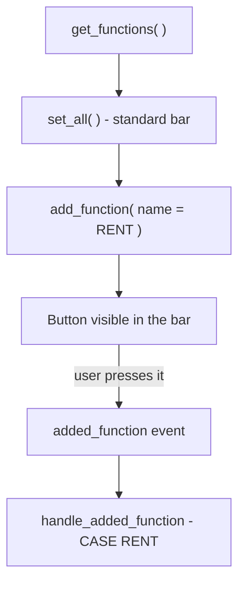

An ALV gives you sorting, filtering, summing and exporting for free. But your business almost always needs something more: a "Generate contract" button, a "Save changes", a "Send for approval". That is where the **custom function** comes in. And once again, SALV and ALV Grid solve it differently; it pays to know which to use.

## In SALV: ask for the functions object and add

With `CL_SALV_TABLE`, the toolbar is an object (`cl_salv_functions_list`) you request from the ALV. First you enable the standard functions, then you add your own.

```abap
FORM set_salv_functions.
  DATA: lo_functions TYPE REF TO cl_salv_functions_list,
        lv_name      TYPE salv_de_function,
        lv_icon      TYPE string,
        lv_tooltip   TYPE string.

  lo_functions = go_salv_table->get_functions( ).
  lo_functions->set_all( ).

  lv_name    = 'RENT'.
  lv_icon    = icon_rental_agreement.
  lv_tooltip = 'Rental contract'.

  TRY.
      lo_functions->add_function(
        EXPORTING
          name     = lv_name
          icon     = lv_icon
          tooltip  = lv_tooltip
          position = if_salv_c_function_position=>right_of_salv_functions ).
    CATCH cx_salv_existing.
    CATCH cx_salv_wrong_call.
  ENDTRY.
ENDFORM.
```

`set_all( )` enables the full stock toolbar; `add_function` places your button to the right of the standard functions. The `TRY ... CATCH` is not optional: the class warns via exception if the name already exists (`cx_salv_existing`) or the call is wrong (`cx_salv_wrong_call`).

## Catching the press: the added_function event

Adding the button is half of it. You still have to react when the user presses it. In SALV that arrives through the `added_function` event of `cl_salv_events_table`.

```abap
CLASS lcl_salv_event DEFINITION.
  PUBLIC SECTION.
    METHODS handle_added_function FOR EVENT added_function
      OF cl_salv_events_table
      IMPORTING e_salv_function.
ENDCLASS.

CLASS lcl_salv_event IMPLEMENTATION.
  METHOD handle_added_function.
    CASE e_salv_function.
      WHEN 'RENT'.
        " business logic of the Contract button
    ENDCASE.
  ENDMETHOD.
ENDCLASS.
```

And the binding, with the usual pattern: ask for the events object and register the handler.

```abap
FORM set_salv_events.
  DATA lo_events TYPE REF TO cl_salv_events_table.
  IF go_salv_event IS NOT BOUND.
    CREATE OBJECT go_salv_event.
    lo_events = go_salv_table->get_event( ).
    SET HANDLER go_salv_event->handle_added_function FOR lo_events.
  ENDIF.
ENDFORM.
```



## In ALV Grid: the toolbar event

If you work with `CL_GUI_ALV_GRID` (for example, because you need editing), the bar is built in the `toolbar` event, appending your button to the `mt_toolbar` table:

```abap
METHOD handle_toolbar.
  DATA ls_toolbar TYPE stb_button.
  ls_toolbar-function  = 'A_SAVE'.
  ls_toolbar-quickinfo = 'Save'.
  ls_toolbar-icon      = '@F_SAVE@'.
  APPEND ls_toolbar TO e_object->mt_toolbar.
ENDMETHOD.
```

The press is then caught in `handle_user_command` by looking at `e_ucomm`. It is more manual than SALV, but it gives you full control over the bar.

## Which to use

- **Read-only list with occasional actions**: SALV with `add_function`. Less code, typed exceptions.
- **Editable grid or heavily customized bar**: `CL_GUI_ALV_GRID` with the `toolbar` event.

> A custom button with no handler is a button that lies to the user. Adding the function and registering the event are one task, not two.

Next post we step onto delicate ground: the editable ALV, where the user no longer just reads but writes, and you have to validate.
