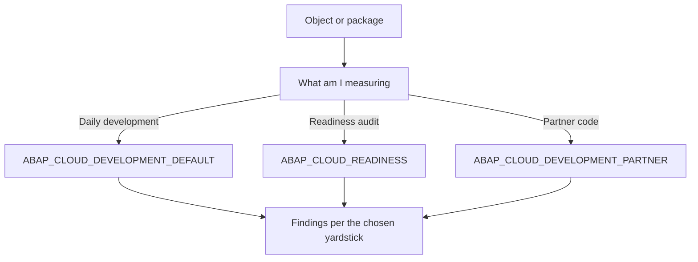

Running the ATC without thinking about the variant is like weighing yourself on a scale when you don't know if it reads kilos or pounds. The **check variant** defines exactly which rules apply, and picking the wrong one gives you either false comfort or a wall of thousands of findings nobody will touch.

## The variants that matter

When you launch `ABAP Test Cockpit with…` on an object, ADT lets you pick a variant via `Browse`. The practical trick: type `abap_` to see the ones admins create. Three show up in every S/4HANA project:

- **ABAP_CLOUD_DEVELOPMENT_DEFAULT**: the default variant. Full, detailed checking, with the basic rules plus the extra ones that ensure custom code is compatible with cloud development. This is what you want day to day.
- **ABAP_CLOUD_READINESS**: a basic cloud readiness check. It verifies the essentials, use of released APIs, object types allowed in the cloud environment. This is the audit variant, not the development one.
- **ABAP_CLOUD_DEVELOPMENT_PARTNER**: aimed at partners building cloud apps and services; it adds extra best-practice and standards checks.



## Choosing a variant in practice

Right click the object, `Run As`, `ABAP Test Cockpit with…`. `ABAP_CLOUD_DEVELOPMENT_DEFAULT` is preselected. With `Browse` you switch to whatever you need:

```abap
" Not an ABAP statement: it's the decision logic
" DEFAULT   -> writing new code, I want the strictest check
" READINESS -> auditing existing code before migrating to ABAP Cloud
" PARTNER   -> shipping an addon, I must meet partner standards
```

Picking the variant right is half the job. The other half is not drowning in history.

## The baseline: the part almost nobody configures

When you first run the ATC on a system with years of code, the initial result is crushing: thousands of accumulated findings. If you treat all of that as immediate backlog, the team gives up on day one and the ATC gets ignored.

The right strategy is to set a **baseline**: you accept the current state as a starting line, and from there the focus is that **new code doesn't worsen the metric**. Historical findings are addressed by priority and on a plan, not in bulk.

- Without a baseline, every run mixes ten years of debt with what you touched yesterday.
- With a baseline, you see what **you** introduced and fix it before transporting.

> A wrong variant lies. A run with no baseline overwhelms. Both end the same way: with the team ignoring the ATC.

Next post: how to wire the ATC into your daily flow with exemptions and pragmas, without it becoming an end-of-line formality.
