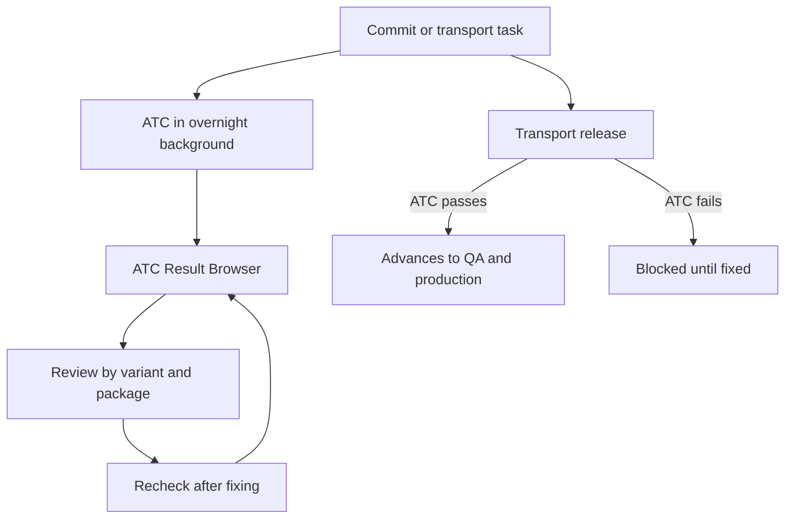

An ATC that only runs when a developer remembers to hit `Ctrl + Shift + F2` is an optional ATC. And optional quality is the kind that doesn't happen. The real goal is for the check to fire by itself, systematically, without depending on anyone's willpower. The ATC ships the pieces for that; you just have to arrange them.

## The three pieces of a continuous ATC

- **Background execution**: checks are scheduled overnight or in batch jobs over multiple packages, blocking no one.
- **ATC Result Browser**: the view that collects those scheduled runs, categorized by variant, with errors, warnings and infos, series name and date. It's the project's quality dashboard.
- **Quality gate on transport**: the ATC plugs into transport release and can allow or block migration based on the check result.

Those three pieces together are, in practice, continuous integration for ABAP: automated checking, centralized results and a gate that stops defective work from advancing.



## The cycle in the Result Browser

The team's daily flow isn't running the ATC by hand, it's reading the results that already ran overnight. From the `ATC Result Browser`:

- `Go to Details` or a double click takes you to the finding directly in the editor.
- `Analyze Result in ATC Problems View` opens it in the traditional view to work on it.
- `Recheck` reruns the same variant after your fix, to confirm it's resolved.

That `Recheck` is the ABAP equivalent of rerunning the build after a fix: you close the loop without switching tools or yardsticks.

## The gate where it really matters

Transport request verification is what turns the ATC from a recommendation into a control. You run the check on the request or the task, just like on an object:

```abap
" Conceptual: the transport request groups several objects
" ATC on the request -> evaluates them all at once with the governed variant
" Reds present -> the gate blocks the release
" Zero reds -> the request advances to QA

" The case the gate catches before production:
DATA lv_result TYPE i.
lv_result = 1 / lv_divisor.   " division with no zero check
```

That error doesn't break compilation, it breaks production. The ATC gate is the last cheap chance to stop it.

> Continuous integration in ABAP isn't a repainted Jenkins server. It's the ATC running overnight, the Result Browser as the dashboard and the transport as the gate. Simple, and almost nobody turns it on.

That closes the ATC series: from why it replaces the Code Inspector to how you turn it into a continuous control that works while you sleep.
