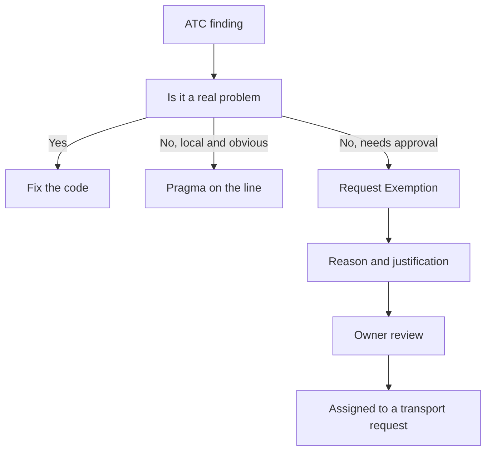

The ATC only helps if it runs while you write, not when there's no turning back. And the moment you wire it into daily work, the awkward question shows up: **what do I do with the finding I know is a false positive?**. There are three answers, and picking the right one is what separates honest code from code that hides debt.

## Three ways to silence a finding

- **Pseudo-comments**: program directives inherited from the Code Inspector. Mostly obsolete and replaced by pragmas, but still relevant in some inspector scenarios.
- **Pragmas**: modern directives that suppress warnings from both the compiler and the extended check. This is the recommended way today.
- **Exemptions**: they approve a finding **without touching the code**, with a justification reviewed and approved by an owner.

The mental rule: pragma or pseudo-comment when the exception is local and obvious on the line; exemption when you need traceability and formal approval.



## Pragmas and pseudo-comments in code

The pseudo-comment goes after the statement with `"#EC`. The pragma goes with `##`:

```abap
" Legacy pseudo-comment: SUBRC intentionally left unevaluated
SELECT FROM sflight FIELDS *
  WHERE currency EQ 'USD'
  INTO TABLE @DATA(t_source).   "#EC CI_SUBRC

" Modern pragma: the variable is declared on purpose even if not used yet
MESSAGE 'Message Text' INTO DATA(lv_message) ##NEEDED.
```

Can't remember the pragma equivalent to an old pseudo-comment? SAP ships the program **ABAP_SLIN_PRAGMAS**, which uses the `SLIN_DESC` table to map equivalences. Available pragmas live in `TRPRAGMA` and `TRPRAGMAT`.

## The exemption process

For a finding you won't fix but that needs to be on record, in `ATC Problems` or `ATC Result Browser` you select `Request Exemption`. You pick a reason (false positive or other), write a justification, and the request is automatically assigned to a transport request. It's logged: who requested it, the validity date and who approved it. If the same user who creates it also approves it, the approver field stays blank, and that's exactly what good quality governance should not allow as routine.

- Fix whenever you can: it's the only thing that truly reduces debt.
- Exempt only what a reviewer would sign off in front of the client.
- Never use a pragma to cover a critical performance or security problem.

> A well-placed pragma documents a decision. A badly placed one buries a bug. The ATC can't tell the difference; you can.

Next post: how to use the ATC to prepare legacy code for ABAP Cloud.
