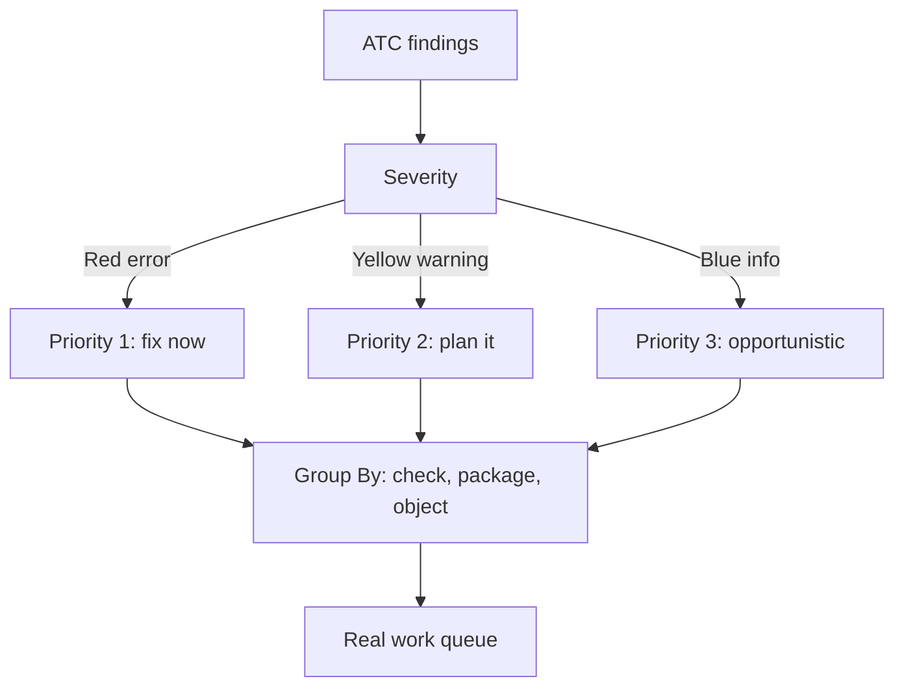

The first time you run the ATC on a big package, the natural reaction is to close the window. Thousands of red, yellow and blue points. The trap is thinking all of that is backlog. It isn't: it's an unprioritized list, and prioritizing it is the only way the ATC becomes useful instead of depressing.

## The three colors and what they mean

The ATC classifies each finding by severity, and the color isn't decorative:

- **Red (error)**: serious problems that directly impact behavior. Priority one, always.
- **Yellow (warning)**: warnings. Not an immediate threat, but worth resolving to meet standards.
- **Blue (info)**: informational. Improves quality, rarely urgent.

Important: none of these stop the code from running. The ATC doesn't measure whether the program works today, it measures whether it will hurt tomorrow, in performance, security or compatibility.



## Group to see patterns, not lines

A flat list of three thousand findings hides the fact that maybe it's ten problems repeated a thousand times. The ATC lets you group: right click any finding, `Group By`, and pick the criterion (by check, by package, by object). Suddenly that wall becomes five attackable categories.

```abap
" Before: 400 identical direct-table-access findings
" Group By check -> 1 pattern, 1 decision, mass fix

" The pattern to eradicate:
SELECT SINGLE * FROM mara INTO @DATA(ls_mara)
  WHERE matnr = @lv_matnr.

" The fix you apply systematically:
SELECT SINGLE matnr, mtart, meins FROM i_product
  WHERE product = @lv_matnr
  INTO @DATA(ls_product).
```

Grouping turns "fix 400 things" into "make 1 decision and apply it 400 times". That's the difference between weeks and hours.

## The strategy that actually scales

- **Baseline first**: freeze the history so every run shows what you introduce, not ten years of debt.
- **Reds no exception**: errors get fixed before transporting. Non-negotiable.
- **Yellows in batches**: grouped by pattern and planned, not attacked at random.
- **Blues opportunistically**: when you're already touching the object for another reason.

> Prioritizing isn't doing less quality. It's ceasing to treat a blue info with the same urgency as a red error, which is exactly how any quality initiative dies of exhaustion.

Next post: how to bring the ATC into a CI pipeline so quality doesn't depend on someone remembering to run it.
