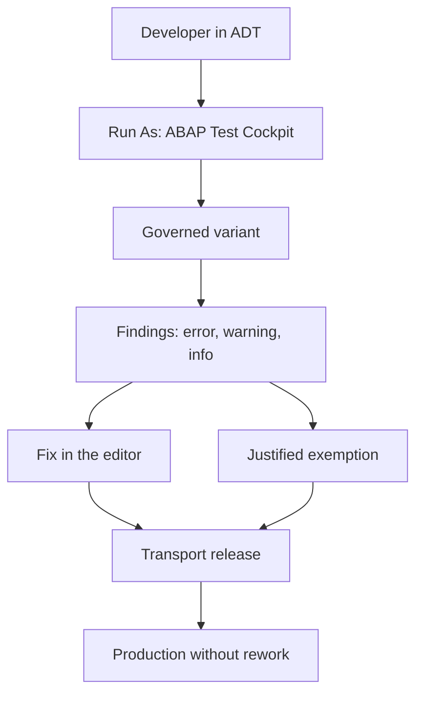

Some teams still open SE80, fire a Code Inspector, glance at the list and move on. The **ABAP Test Cockpit (ATC)** exists precisely so that stops being a manual ritual and becomes part of the flow. This isn't marketing: it's a shift in where quality actually lives.

## What the ATC really is

The ATC is a tool for checking code quality in ABAP environments. It runs automated, configurable checks over single objects, whole packages and transport requests, always based on **variants** defined by administrators. It lives inside ADT in Eclipse, with its own views: **ATC Problems**, **ATC Results**, **ATC Exemptions** and the **ATC Result Browser**.

The difference from the old Code Inspector isn't cosmetic:

- **Governed variants**: admins set a standard variant (for example `ABAP_CLOUD_DEVELOPMENT_DEFAULT`) and the whole team measures against the same yardstick.
- **Mass scope**: it checks one object, a full package or a transport request with the same action.
- **Exemptions with justification**: a finding you won't fix gets approved with a reviewable reason, not silently ignored.
- **Quality gate on transport**: the ATC plugs into transport release and can block migration if the code doesn't pass.



## Launching it costs one shortcut

On a class or a program: right click, `Run As`, `ABAP Test Cockpit`, or straight to `Ctrl + Shift + F2`. It runs the default variant and the view lists the points to fix with their description, line, object type and check. The detail and the recommendation show up on the right.

ATC findings don't stop the code from running. They point at something else: maintainability, performance, security and future compatibility. Exactly the kind of debt that doesn't blow up on demo day but does on the upgrade.

```abap
SELECT FROM sflight FIELDS *
  WHERE currency EQ 'USD'
  INTO TABLE @DATA(t_source).   "#EC CI_SUBRC
```

That `"#EC CI_SUBRC` is a pseudo-comment inherited straight from the Code Inspector: it tells the check that the unevaluated `SUBRC` is intentional. The ATC understands that legacy, but it nudges you toward modern pragmas.

## Why the shift matters

- The Code Inspector was a snapshot you took when you remembered to.
- The ATC is a continuous process, with a shared variant, background execution and traceable exemptions.

> Quality isn't a checklist you review on Friday before transporting. It's a control the system applies for you, with the same rule for the whole team.

Next post: how check variants are chosen and why you need a baseline before touching legacy code.
