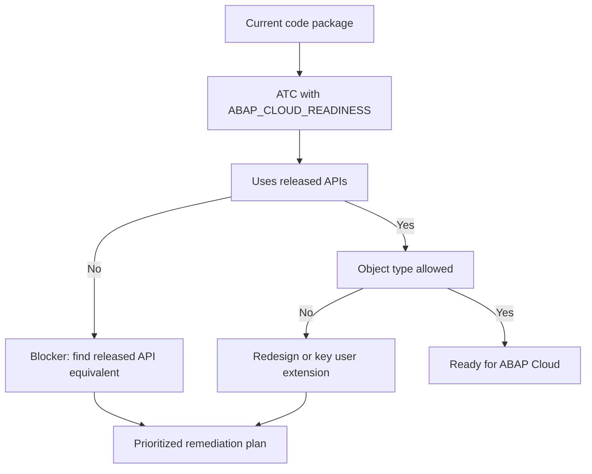

Migrating to ABAP Cloud without measuring first is signing a blank check. The good news: the ATC already ships the instrument to know what of your code is cloud-ready and what will hold you back. It's called **ABAP_CLOUD_READINESS**, and it's the difference between planning and praying.

## What the readiness variant checks

`ABAP_CLOUD_READINESS` is a basic cloud readiness check. It's not the daily development variant; its job is to audit. It verifies the essentials for the cloud environment:

- **Use of released APIs**: if your code calls something SAP hasn't released, in ABAP Cloud you simply won't have it.
- **Allowed object types**: not every object type exists or is permitted in the cloud development model.
- **Language constructs compatible** with ABAP for Cloud Development.

The idea is to run this variant over whole packages and get a real inventory of blockers, not a hunch.



## From finding to plan

The ATC doesn't migrate for you; it hands you the map. A typical pattern the readiness variant flags is direct access to standard tables that in ABAP Cloud must go through an API or a released CDS:

```abap
" Red in ABAP_CLOUD_READINESS: direct access to a standard table
SELECT FROM vbak FIELDS vbeln, erdat
  INTO TABLE @DATA(lt_orders).

" Green: consume the released CDS equivalent
SELECT FROM i_salesorder FIELDS salesorder, creationdate
  INTO TABLE @DATA(lt_orders_cloud).
```

The first block works on your classic ECC or S/4 and dies in ABAP Cloud. The second respects the stability contract. The readiness variant is what separates one from the other before it's too late.

## How we use it on a migration project

- Run `ABAP_CLOUD_READINESS` in the background over all custom packages.
- Review the results in the `ATC Result Browser`, grouped by check and by package.
- Classify: what has a released API equivalent (mechanical change) versus what demands a redesign or a key user extension.
- Prioritize by volume and criticality, not alphabetical order.

> The readiness variant doesn't make the migration faster. It makes you know what it costs before you commit, which is exactly what most estimates are missing.

Next post: how to prioritize ATC findings so you don't drown among reds, yellows and blues.
