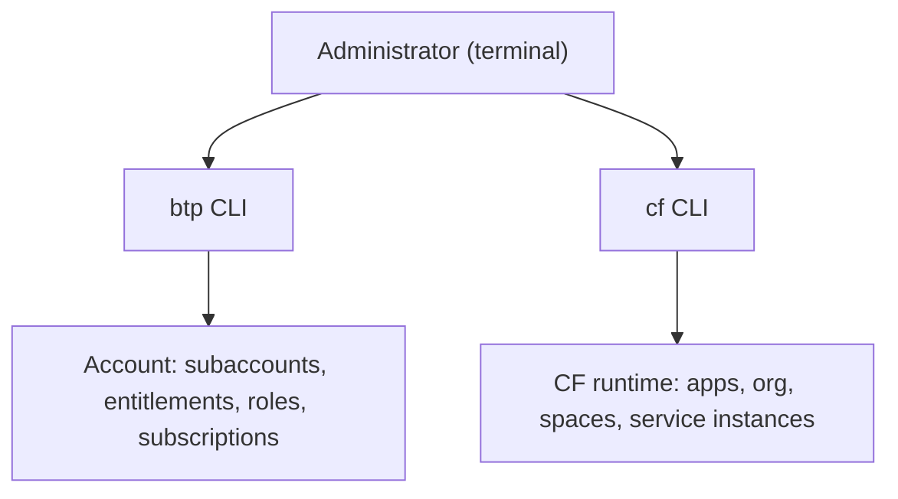

The BTP Cockpit is an excellent graphical interface for exploring the platform and doing a one-off configuration. But nothing you do in the Cockpit ends up reflected in a script, nor repeats identically across environments, nor gets reviewed in a pull request. For real governance, the terminal is not optional.

## Two CLIs, two scopes

There's a common confusion worth pinning down up front:

- **btp CLI**: administers the **account**. Global account, directories, subaccounts, entitlements, role collections, subscriptions. It's the platform administrator's tool.
- **cf CLI**: administers the **Cloud Foundry runtime**. Apps, service instances, organizations, spaces and users inside a subaccount with CF enabled. The CF CLI runs REST calls against the Cloud Foundry instance.

All Cloud Foundry providers use **the same cf CLI**, not just SAP: it's an open-source standard. That means what you learn here is transferable.



## cf CLI: the minimum flow

Before touching anything, you connect and set the target (org and space). Working without a clear `target` is the recipe for deploying in the wrong place:

```bash
# Set the region API endpoint
cf api https://api.cf.eu10.hana.ondemand.com

# Log in
cf login -u user@company.com

# View and set target organization and space
cf target -o MY_ORG -s DEV

# List available organizations and spaces
cf orgs
cf spaces

# Operate on applications
cf apps
cf logs MY_APP --recent
cf restart MY_APP
```

## Why this is governance, not convenience

The value of the CLI isn't typing faster. It's that **everything is reproducible and auditable**:

1. A provisioning script creates the same subaccount with the same entitlements in DEV, QA and PROD, with no human drift.
2. Cloud Foundry's administrative separation lets administrators and developers work in parallel on the same org.
3. Every command can live in a repository, be reviewed and run in a pipeline. The Cockpit cannot.

Commands worth keeping at hand day to day with cf CLI: `cf routes` to view routes, `cf domains` for domains, `cf create-user` and `cf delete-user` for platform user management, and `cf copy-source` to promote one app's code to another without recompiling.

> The click in the Cockpit is forgotten the moment you close the tab. The command in a script keeps documenting, a year later, exactly what was provisioned and why.

Next post: subscriptions and service instances, the two kinds of resource you'll administer with these same tools.
