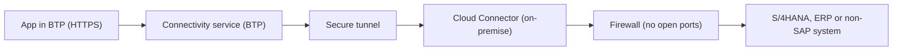

The question comes up in every project: "I need my BTP app to talk to the on-premise S/4HANA, I'll open a firewall port and done". No. Opening a port per service, exposing internal systems directly to the internet, is exactly what you **don't** do. The platform has a better and safer mechanism.

## Cloud Connector: the tunnel, not the door

The **SAP Cloud Connector** is an **on-premise** agent that acts as a proxy, establishing a secure tunnel between your internal network and the BTP subaccount. Once configured, **only** SAP Cloud products or the apps you've deployed on the platform can reach the internal systems. And with granular control: you decide which systems and which specific resources are exposed, nothing more.

Its key traits:

- Link between BTP apps and local systems, SAP and non-SAP.
- Automatic recovery of broken connections and audit logs of inbound traffic.
- High-availability configurations for critical scenarios.



## Destinations: the connection configuration

A **destination** defines how a BTP app or service connects to an external system: unique name, type (protocol), URL, credentials and parameters. They're managed from the **Connectivity** menu in the Cockpit, where you can create, edit, import destinations and certificates, and renew trust.

There are three main types:

- **HTTP**: communication over HTTP/HTTPS. For consuming a REST API, an OData service or an on-premise S/4HANA.
- **RFC**: configuration to talk to a local ABAP system via Remote Function Call, using the Java Connector (JCo).
- **Mail**: to specify an SMTP provider and send or receive emails from a BTP service.

## The properties you'll actually use

An HTTP destination toward an S/4HANA rarely works without the correct additional properties. An example of a well-typed destination toward an ABAP service catalog:

```json
{
  "Name": "S4H_ONPREM",
  "Type": "HTTP",
  "URL": "http://s4host.corp:8000",
  "ProxyType": "OnPremise",
  "Authentication": "BasicAuthentication",
  "sap-client": "100",
  "sap-language": "EN",
  "WebIDEEnabled": "true",
  "WebIDEUsage": "odata_abap,dev_abap",
  "HTML5.DynamicDestination": "true"
}
```

Notice three decisions:

1. `ProxyType: OnPremise` is what routes the request through the Cloud Connector instead of going out to the internet.
2. `sap-client` and `sap-language` are mandatory for S/4HANA systems: without them, logon fails or lands in the wrong client.
3. `WebIDEUsage: odata_abap,dev_abap` enables the service catalog and deployment to the ABAP repository from Business Application Studio.

> Opening a port is fast today and a security breach tomorrow. The Cloud Connector tunnel costs you one configuration and saves you the incident.

Next post: administering all of this from the terminal with the btp CLI, without depending on the Cockpit.
