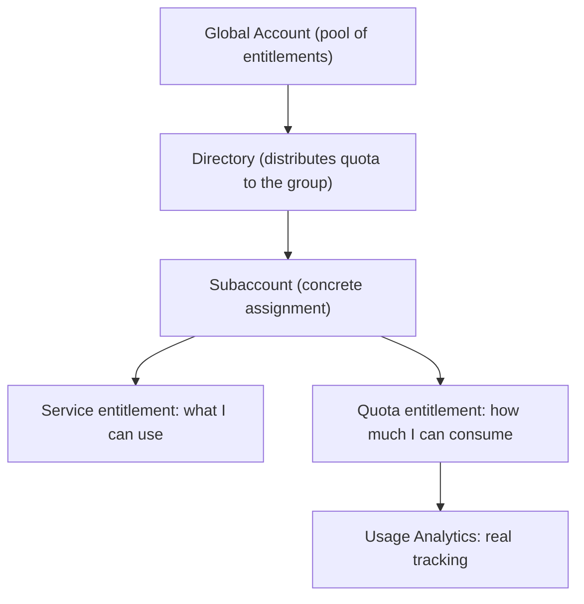

Having a global account doesn't mean you can use anything yet. It means SAP has handed you a bag of **entitlements and quotas** that you, and only you, have to distribute. That distribution is the single most important spending-control lever on the whole platform, and almost nobody treats it with the respect it deserves.

## The two kinds of entitlement

In the **Entitlements** section of the BTP Cockpit you define which resources and services are authorized on the platform. There are two categories, and confusing them is the first mistake:

- **Service entitlements**: define **access** to specific services (Cloud Foundry runtime, development tools, integration capabilities). They specify which features and plans you can use.
- **Quota entitlements**: define the **consumption limits** of those services. Memory, storage, CPU usage, number of instances. This is the real spending ceiling.

The distinction matters: having an active service entitlement costs nothing; exhausting a quota does. Cost control lives in the quota, not the service.



## The distribution flow, top down

Entitlements flow down the hierarchy. The global account receives them; directories distribute them at group level; subaccounts get their concrete assignment. When a directory sits in the middle, the administration of subaccount quotas and entitlements **is also done in the directory**. That is exactly what turns the hierarchy from the previous post into a budgeting tool and not a drawing.

And to close the loop, the **Usage Analytics** section lets you monitor what is actually consumed:

- Service usage: running instances, memory, storage, API calls.
- Usage of deployed custom applications.
- Cloud Foundry metrics: CPU, memory, uptime per app.

## Governance from day 1

With the btp CLI the distribution stops being clicks and becomes an auditable script:

```bash
# View the entitlements assigned to a subaccount
btp list accounts/entitlement --subaccount <SUBACCOUNT_ID>

# Assign a service with its plan and quota to a subaccount
btp assign accounts/entitlement \
  --to-subaccount <SUBACCOUNT_ID> \
  --for-service hana-cloud \
  --plan hana \
  --amount 1
```

Our discipline on every project:

1. Distribute quota **explicitly** per subaccount. Never leave production with "everything available": that's the surprise invoice.
2. Reserve a free plan for testing when one exists (some services offer 90 days), but don't confuse it with the productive plan.
3. Review Usage Analytics before Finance does, not after.

> The entitlement you don't distribute with judgment today is the cost overrun you discover at month end without knowing which subaccount it came from.

Next post: the roles and users model, where access control becomes as granular as quota control.
