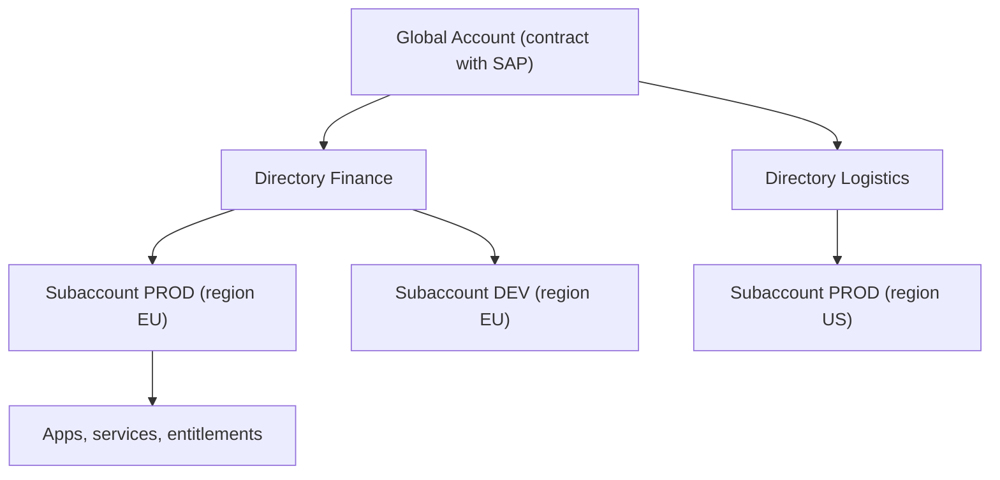

Most governance disasters in SAP BTP don't come from a misconfigured service. They come from **not deciding, before creating the first subaccount, how the account hierarchy is organized**. And by the time the first cost audit or the first security incident arrives, it's too late to reorder.

## The three levels that matter

- **Global account**: the contract with SAP. This is where the **entitlements and quotas** land, and where the commercial model is decided: consumption-based or subscription-based. It consumes no resources itself; it distributes them.
- **Directories**: an **optional** grouping layer. It organizes subaccounts by project, team, department or company. A directory can contain other directories and subaccounts, forming a real hierarchy.
- **Subaccounts**: this is where everything operational happens. Applications are subscribed, services deployed, access managed. Each subaccount is **independent** in region, administrators and license type.

The golden rule: **the subaccount is the unit of isolation**. Region, users and entitlements are decided there. If you mix production and testing in the same subaccount, you don't have a boundary, you have an accident waiting.



## Why directories aren't really optional

SAP calls them optional, and technically they are. But the moment you have more than three or four subaccounts, managing entitlements flat becomes unmanageable. The directory lets you **distribute quotas and entitlements** at group level and delegate administration. Each directory, like each global account and each subaccount, requires at least one administrator user.

With the btp CLI the hierarchy is inspectable and reproducible from the terminal, not a drawing that only lives in the Cockpit:

```bash
# View the full structure of the global account
btp get accounts/global-account --show-hierarchy

# List directories and subaccounts
btp list accounts/subaccount

# Create a dedicated subaccount per environment, with its region
btp create accounts/subaccount \
  --display-name "Finance-PROD" \
  --region eu10 \
  --subdomain finance-prod
```

Our practical recommendation when starting any project:

1. One directory per functional domain or business unit, not per organizational whim.
2. Subaccounts split by **environment** (DEV, QA, PROD), never shared.
3. The region is chosen by where the end users are and by the infrastructure provider (Azure, GCP, AWS, Alibaba), and it **doesn't change**: it's immutable per subaccount.

## The mistake you'll see in every project

A single giant subaccount where development, testing and production coexist, with all administrators seeing everything. It works the first month and is impossible to audit the day Finance asks how much each project costs.

> Designing the hierarchy costs you an afternoon today. Not designing it costs you redoing all the security and billing once the project is already in production.

Next post: how entitlements and quotas turn this hierarchy into a budget that doesn't overflow.
