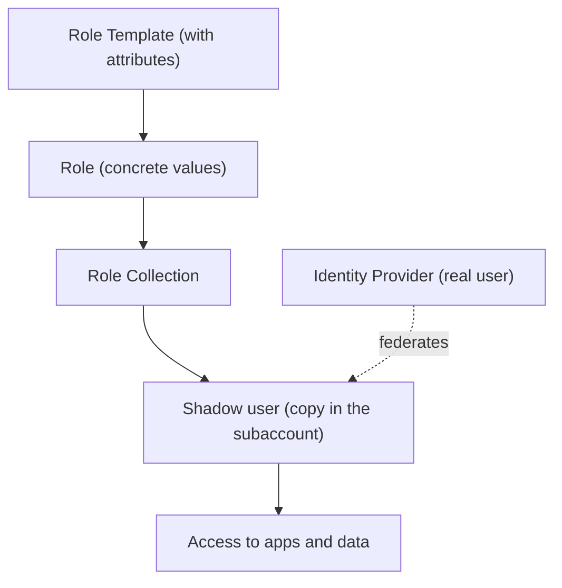

In SAP BTP you don't assign permissions to users. Never directly. Between the permission and the person there's a chain of three links that exists for a very specific security reason, and whoever ignores it ends up with an access model impossible to audit.

## The chain: template, role, collection

- **Role template**: the predefined starting point. It carries the attributes that control data access. You should only create roles **from templates**.
- **Role**: a concrete set of permissions, instantiated from a template. This is where attribute values are set.
- **Role collection**: groups one or more roles. This is what **gets assigned** to users or groups.

The golden rule: **you assign collections, not loose roles**. And those collections are assigned to **shadow users**, not to the real identity.



## What a shadow user is and why it exists

All users are stored in an **Identity Provider** (SAP ID by default, or a custom one). When you perform an action on a user, BTP creates a **local copy**: the shadow user. Role collections are assigned to that copy, not to the original user. This keeps the identity data protected in the IdP.

A detail that matters for GDPR: when an employee leaves the company, you sometimes have to **delete the shadow user** to comply with data protection. If you didn't know it existed, you're not cleaning it up.

## Predefined collections and attributes

BTP ships collections that **cannot be modified or deleted**. The ones used daily:

- `Global Account Administrator`, `Subaccount Administrator`, `Directory Administrator`: administrative access per level.
- `Connectivity and Destination Administrator`, `Cloud Connector Administrator`: for connectivity.
- The `Viewer` variants: read only.

The powerful part comes with **role attributes**, which enable instance-based authorizations: a user sees only a subset of data (by country, by warehouse plant). They can be:

1. **Static**: the value is set when the role is assigned in the collection.
2. **From a custom IdP**: the value comes from the identity provider.
3. **Unrestricted**: no concrete value needed.

And from the btp CLI, assigning a collection to a user is a reproducible line, not an unrepeatable click:

```bash
# List the role collections of a subaccount
btp list security/role-collection --subaccount <SUBACCOUNT_ID>

# Assign a role collection to a user
btp assign security/role-collection "Subaccount Administrator" \
  --to-user admin@company.com \
  --subaccount <SUBACCOUNT_ID>
```

> The three-link model looks like bureaucracy until the first audit. That's when you discover that assigning direct permissions was the most expensive technical debt in the whole project.

Next post: destinations and connectivity, where these users and roles meet the on-premise systems.
