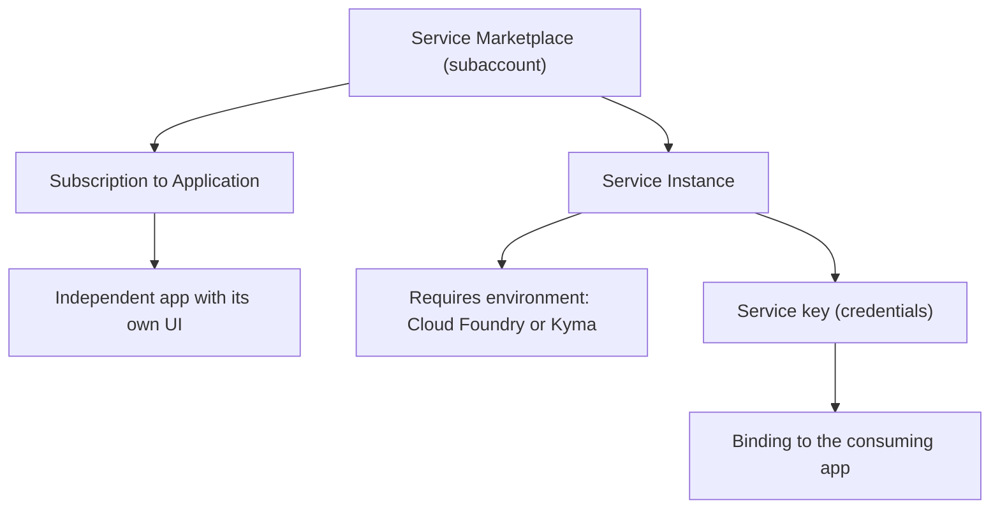

In a subaccount's Service Marketplace there are two things that look alike and aren't: **applications you subscribe to** and **service instances you create**. Choosing wrong between them is the silent origin of half the architecture and quota problems in BTP. Let's separate them once and for all.

## Applications (subscriptions)

An **application** in BTP is an **independent** service that runs **without** needing an additional runtime environment or another service. Most bring their own interface that you open and use directly. They typically consume limited quotas. Examples: SAP Business Application Studio, SAP Build Apps, the ABAP Environment.

You **subscribe** to them. In the **Instances and Subscriptions** section of the subaccount you see which subscriptions are assigned.

## Service instances

A **service instance** is a resource that **does require an additional environment** (Cloud Foundry or Kyma) to work. They are a set of capabilities you consume via API or via bindings. They're created from the Cockpit or from the cf CLI.

What you need to be clear on when creating them:

- First you choose the right **service plan**. Some offer a free plan to try for a limited time, for example 90 days.
- Creating the instance generates an **instance key** (service key) the app uses to access the service.
- They serve to connect and extend applications, your own, SAP's or third-party, and to access data, analytics or AI.



## Creating an instance from the cf CLI

To close the series, here's how to instantiate and bind a service from the terminal, reproducible and auditable:

```bash
# View available services and plans in the marketplace
cf marketplace

# Create a service instance with its plan
cf create-service xsuaa application my-xsuaa

# Generate a service key to inspect credentials
cf create-service-key my-xsuaa my-key

# Bind the instance to a deployed application
cf bind-service MY_APP my-xsuaa
cf restart MY_APP
```

## The decision that avoids rework

The right question before touching the marketplace isn't "which service do I want?" but "**is it an app you subscribe to or a service you instantiate and bind?**". The plan, the quota you spend and whether you need a CF or Kyma environment behind it all depend on that answer.

> Subscribing to what should have been instantiated, or the other way around, doesn't fail on demo day. It fails the day you try to scale and discover the architecture was wrong from the marketplace onward.

This closes the SAP BTP administration series: hierarchy, entitlements, roles, connectivity, CLI and services. Governance from day 1, not as a patch.
