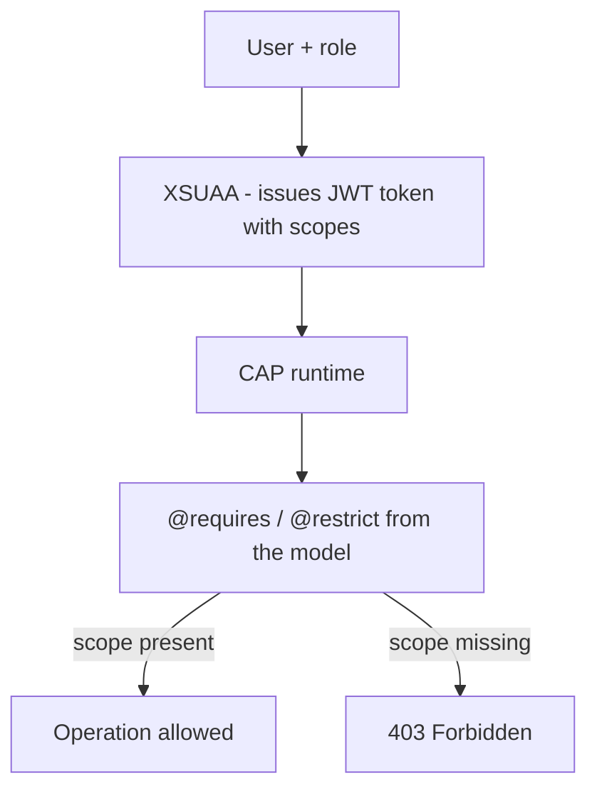

The worst way to protect a CAP service is the one seen in too many projects: an `if (req.user.is('admin'))` scattered across handlers. Miss one, and you've got a hole. CAP does the opposite: **authorization is declared in the model with annotations**, and the runtime enforces it across every operation without you writing a single `if`.

## The two pieces: who you are and what you can do

- **Authentication (who you are)**: handled by **XSUAA**, the BTP service that issues and validates the JWT token. CAP doesn't manage users; it trusts the token.
- **Authorization (what you can do)**: you declare it in CDS with `@requires` and `@restrict`. The runtime compares the token's **scopes** against the annotation.



## Declare permissions in the model, not in code

Security lives next to the entity it protects. Here `Products` requires an authenticated user, and only the `Admin` role can write:

```cds
service CatalogService @(requires: 'authenticated-user') {

  entity Products @(restrict: [
    { grant: 'READ',            to: 'authenticated-user' },
    { grant: ['CREATE','UPDATE','DELETE'], to: 'Admin' }
  ]) as projection on com.logali.Products;

  entity Reviews @(readonly) as projection on com.logali.ProductReview;
}
```

The powerful part is that this isn't documentation: it's executable. The runtime blocks a DELETE from anyone without the `Admin` role, on every route, without you touching a handler. A forgotten `if` can't happen because there is no `if`.

## The xs-security.json: where the role becomes a scope

XSUAA doesn't understand plain "roles"; it understands **scopes** and **role templates**. The `xs-security.json` is the bridge between the role name in your annotation and what the token actually carries:

```json
{
  "xsappname": "products-catalog",
  "scopes": [
    { "name": "$XSAPPNAME.Admin", "description": "Catalog administrator" }
  ],
  "role-templates": [
    { "name": "Admin", "scope-references": [ "$XSAPPNAME.Admin" ] }
  ]
}
```

The `Admin` in your `@restrict` matches the `Admin` role template, which references the `$XSAPPNAME.Admin` scope. That scope travels in the JWT XSUAA issues. If the trio (annotation, role template, scope) doesn't line up, the right user gets a 403 and you go mad hunting the bug in code, where it isn't.

## The mistake that costs an afternoon of debugging

Putting the `@restrict` in the model and forgetting the scope in `xs-security.json`, or deploying without rebinding XSUAA. The service denies everything and there's no useful trace in Node, because the rejection happens in the declarative authorization layer, not in your logic. Before touching code, always check that the annotation's role exists as a scope and is assigned.

> In CAP security is part of the model, not a handler decoration. If your authorization depends on nobody forgetting an `if`, you don't have authorization, you have luck.

That closes the CAP series: from the CDS model to permissions, the same principle throughout, declare what can be declared and code only what can't.
