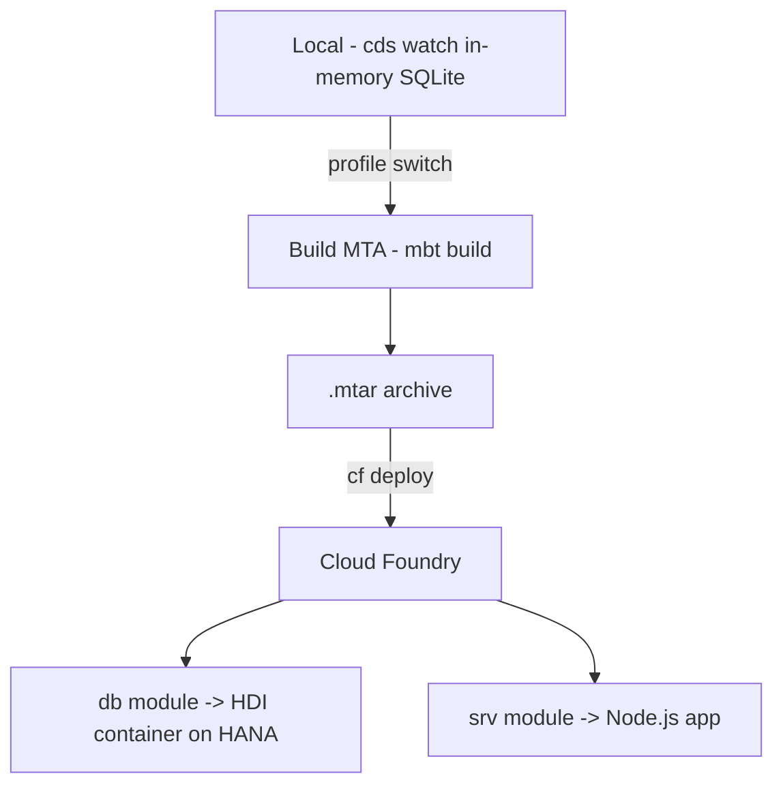

On your laptop, `cds watch` spins the project up on an in-memory SQLite database and everything works in seconds. That's exactly the problem: **local ease hides everything that changes when you deploy to BTP**. The jump to Cloud Foundry isn't just another `push`; it's going from one process to several modules you have to orchestrate.

## What changes between local and production

- The database stops being in-memory SQLite and becomes **HANA Cloud** with an **HDI** container (HANA Deployment Infrastructure).
- The project stops being a folder and becomes an **MTA** (Multi-Target Application) with several modules.
- The database connection is no longer in a local `default-env.json`, but in a Cloud Foundry **service binding**.



## The mta.yaml: who depends on whom

The `mta.yaml` is the file that declares modules and their dependencies. Without it, Cloud Foundry has no idea the service needs the database before starting:

```yaml
modules:
  - name: products-srv
    type: nodejs
    path: gen/srv
    requires:
      - name: products-db
      - name: products-uaa

  - name: products-db-deployer
    type: hdb
    path: gen/db
    requires:
      - name: products-db

resources:
  - name: products-db
    type: com.sap.xs.hdi-container
  - name: products-uaa
    type: org.cloudfoundry.managed-service
    parameters:
      service: xsuaa
      service-plan: application
```

Look at the `requires`: the `srv` module depends on `db` and `uaa`. That graph is what guarantees deploy order. Omit it and your service starts before the table exists and blows up on the first request.

## Profiles: same app, two configurations

CAP solves the "one thing locally, another in production" problem with profiles in `package.json`. You switch the database `kind` to `hana` without touching code:

```json
{
  "cds": {
    "requires": {
      "db": { "kind": "hana" }
    }
  }
}
```

In development you use SQLite; the production profile points to HANA. Same codebase, two targets. That's what lets you test fast locally without lying to yourself about what runs in the cloud.

## The classic first-deploy mistake

Compile and `cf push` the `srv` folder bare, with no MTA build. Startup works, the first data access fails: no HDI container, no binding, no tables. Deploying CAP isn't pushing a folder, it's building the `.mtar` (`Build MTA Project`) and deploying the full application with its dependencies.

> `cds watch` is your friend for iterating. `mta.yaml` is your contract with the cloud. Confusing one for the other is the root of 90% of failed deploys.

Next post: remote services and integrating with S/4HANA without dragging half the ERP into BTP.
