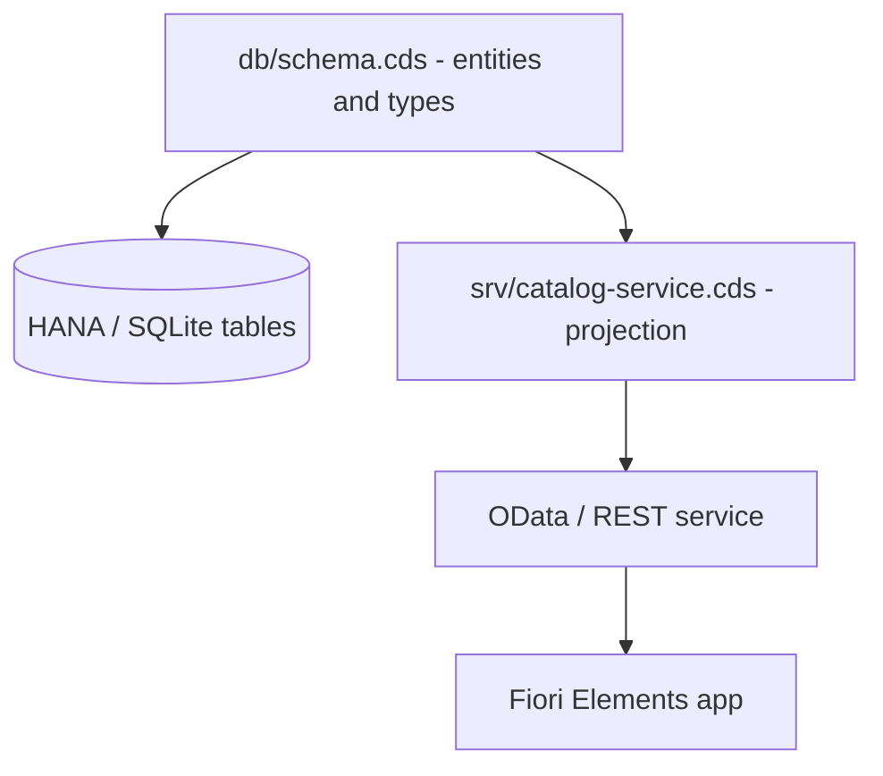

CAP (Cloud Application Programming Model) hides a good idea inside its folder layout: **the data model and the services are different things and they live apart**. When `cds init` generates a project, it creates `db/` and `srv/` for a reason, not as decorative convention. The day you ignore that split is the day your schema and your API get wired together with baling wire.

## Two layers, two files

- **`db/schema.cds`**: the domain model. Entities, types, keys, associations. This becomes tables when you run `cds deploy`.
- **`srv/catalog-service.cds`**: the service. It projects the schema entities, renames them, restricts them and decides what goes out to the world over OData.

The rule that separates a healthy project from a rotting one: **the service never redefines the domain, it projects it**. If your `catalog-service.cds` declares entities from scratch instead of projecting those in `schema.cds`, you've already lost.



## The schema: pure domain

In `db/schema.cds` you define the domain with its namespace, without thinking about the API yet:

```cds
namespace com.logali;

entity Products {
  key ID          : UUID;
      Name        : String not null;
      Description : String;
      Price       : Decimal(16,2);
      Category    : Association to Categories;
      Supplier    : Association to Suppliers;
      Reviews     : Association to many ProductReview on Reviews.Product = $self;
}

entity Categories {
  key ID   : String(1);
      Name : String;
}
```

Notice there is not a single UI annotation or rename here. Just domain: UUID keys, `not null`, managed associations. This is what survives screen changes.

## The service: projection, not copy

In `srv/catalog-service.cds` you `using` the schema and project:

```cds
using com.logali from '../db/schema';

service CatalogService {
  entity Products as select from com.logali.Products {
    ID,
    Name as ProductName,
    Description,
    Price,
    Category.Name as Category,
    Supplier,
    Reviews
  };
}
```

The `Name as ProductName` and `Category.Name as Category` are API decisions, not domain ones. They live here precisely so you can change the public face of the service without touching a single table.

## The mistake you'll see in every project

A single `.cds` file with entities, associations, UI annotations and service logic, all mixed together. It compiles, it works in the demo and it's impossible to evolve. The moment marketing asks to rename a field, you end up touching the schema and redoing the `cds deploy`.

> Splitting `db` from `srv` costs zero: it comes done. Merging them back into one file costs you every change from here to production.

Next post: handlers in Node.js and why 80% of your CAP needs you to write no JavaScript at all.
