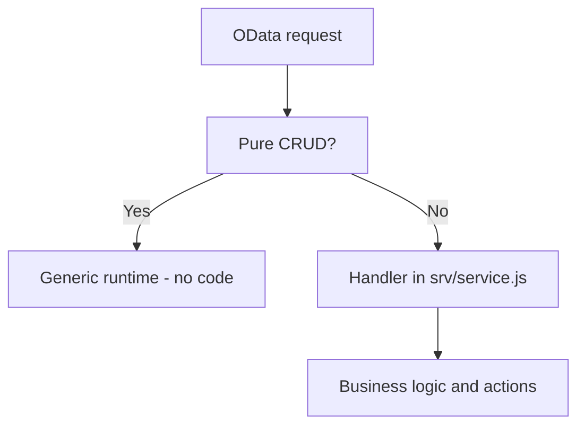

The most expensive misunderstanding about CAP is thinking you have to code every operation. You don't. CAP's **generic runtime** already serves create, read, update, delete, pagination, `$filter`, `$expand` and even value helps, all derived from the CDS model. If you're writing a handler for a READ that just reads the table, you're doing it wrong.

## Where the model ends and code begins

Node.js handlers are for what the model **cannot** declare:

- Business validations that depend on state (not on a `@mandatory`).
- **Actions** and **functions**: operations that aren't CRUD.
- Side effects: send an email, call an external service, recompute.



## Functions and actions: declared in CDS

First you declare the contract in the `.cds`, bound to the entity:

```cds
extend service CatalogService with {
  function getClientTaxRate(clientEmail : String(65)) returns Decimal(4,2);

  action cancelOrder(clientEmail : String(65)) returns {
    status  : String enum { Succeeded; Failed; };
    message : String;
  };
}
```

Note the distinction CAP takes seriously: a **function** (`getClientTaxRate`) reads and changes no state; an **action** (`cancelOrder`) modifies. It's not cosmetic: OData maps the function to GET and the action to POST.

## The handler: only the logic that matters

In `srv/catalog-service.js` you implement the behaviour with the `srv` API:

```javascript
module.exports = (srv) => {
  const { Orders } = srv.entities;

  srv.on('cancelOrder', async (req) => {
    const { clientEmail } = req.data;
    const order = await SELECT.one.from(Orders).where({ clientEmail });

    if (!order) return req.error(404, 'Order not found');
    if (order.Status === 'A') {
      return { status: 'Failed', message: 'The order was already approved' };
    }

    await UPDATE(Orders).set({ Status: 'C' }).where({ ID: order.ID });
    return { status: 'Succeeded', message: `Cancelled for ${order.FirstName} ${order.LastName}` };
  });
};
```

Three things this handler does right:

1. It uses **CQL** (`SELECT`, `UPDATE`) instead of raw SQL: database-agnostic.
2. It returns errors with `req.error`, it doesn't throw loose exceptions.
3. It doesn't reimplement the CRUD for `Orders`: only the cancellation rule. The runtime keeps serving everything else.

## The usual anti-pattern

`srv.on('READ', ...)` handlers that run a `SELECT` and return exactly what the runtime would already return. That adds nothing and strips away free pagination and filtering. If your handler doesn't add a rule the model can't express, delete it.

> In CAP the best handler is the one that doesn't exist. The second best fits in fifteen lines because it holds only the business rule.

Next post: CAP versus RAP, when to use each, no tribalism.
