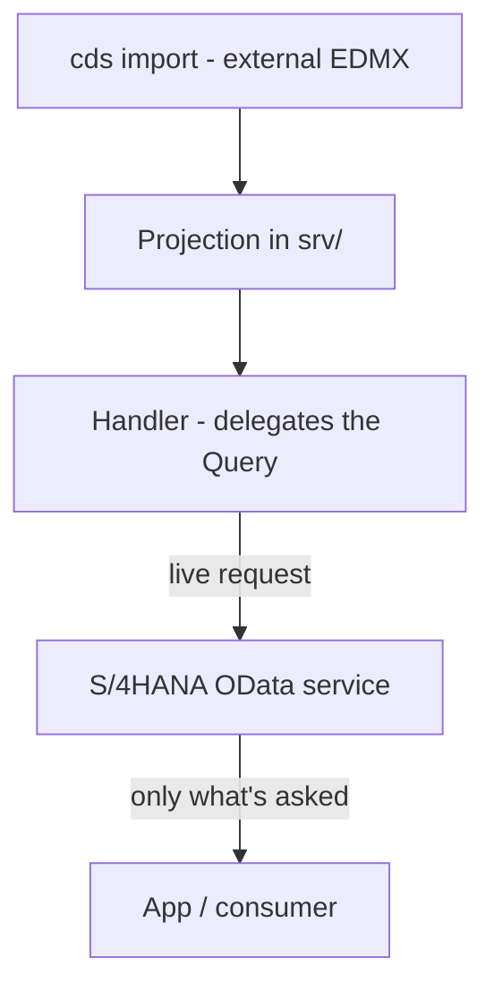

The temptation, when your CAP app needs S/4HANA data, is to replicate it: a nightly job copying tables to HANA Cloud and praying they don't drift apart. It's almost always a mistake. CAP has a better mechanism: **import the external OData service, project it as your own and delegate the query to the backend in real time**.

## The flow: import, project, delegate

- **Import**: `cds import` takes the external service metadata (the EDMX) and pulls it into your project as just another model.
- **Project**: you define your own entity as a projection of the remote one. Your API doesn't expose the provider's, it exposes yours.
- **Delegate**: in the handler you forward the query to the remote service. The data is never copied, it's read on the fly.



## Project the external service

After importing, you declare your entity as a read of the remote one. Here you expose `Incidents` from the S/4 service's `IncidentsSet`:

```cds
using { YSAPUI5_SRV as ext } from './external/YSAPUI5_SRV';

service RemoteService {
  entity Incidents as projection on ext.IncidentsSet;
}
```

Your consumer sees `Incidents`, not `IncidentsSet`. That gives you an isolation layer: if the provider renames its entity, you touch one line, not the whole app.

## Delegate the query, don't fetch everything

The performance key is in the handler: you forward **the same query** with its filters and ordering to the backend, so S/4 returns only what's asked, not the whole table:

```javascript
module.exports = (srv) => {
  const ext = await cds.connect.to('YSAPUI5_SRV');

  srv.on('READ', 'Incidents', async (req) => {
    // the Query is broken down: where + orderBy travel to the backend
    return ext.run(req.query);
  });
};
```

The `ext.run(req.query)` is what separates this from a dumb proxy: the `$filter` and `$orderby` arriving from the client are translated and travel to S/4HANA. No fetching ten thousand incidents to filter three in Node.

## The anti-pattern: replicating for convenience

Copying the data to HANA Cloud "to have it close" looks fast and costs dearly: you buy yourself a sync problem, stale data and a table to maintain. Replicate only when you genuinely need the data offline or massive local joins. For point reads, delegate.

> A well-projected remote service is a facade, not a copy. The day the provider changes something, you want to touch a projection, not reconcile two databases.

Next post: authentication and authorization in CAP with XSUAA, where annotations become permissions.
