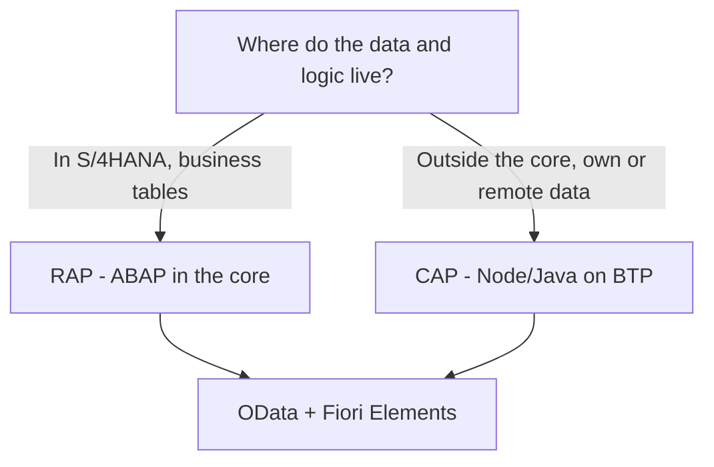

Every time someone asks "CAP or RAP" they expect a tribe answer. They won't get one. Both are the same pattern (CDS model, OData service, Fiori app) deployed in two different places. The right question isn't which is better, it's **where your logic lives and where your team lives**.

## The difference that actually decides

- **RAP** (ABAP RESTful Application Programming): your logic runs in **ABAP inside the S/4HANA stack**. Behavior definitions, behavior implementations in ABAP classes, transactions over the system's own business tables.
- **CAP**: your logic runs in **Node.js or Java on BTP**, against your own database (HANA Cloud) or consuming remote services. The model is written in CDS/CDL and the handlers in the runtime language.



## When RAP

RAP wins when the logic **is** the core: you create or modify S/4HANA business objects, you need locking, determinations and validations glued to the tables, and your team is ABAP. Extending a standard object or building a transactional app over data that already lives in the system: RAP territory.

## When CAP

CAP wins when the application lives **beside** the core, not inside it:

```cds
using { API_BUSINESS_PARTNER as bp } from './external/API_BUSINESS_PARTNER';

service RemoteService {
  entity BusinessPartners as projection on bp.A_BusinessPartner;
}
```

Here CAP projects a remote S/4 service without holding the data at home. It's the typical scenario: a new BTP app that combines its own data with reads from S/4HANA, with a team comfortable in JavaScript or Java. Textbook side-by-side extensibility.

## The most common choice mistake

Choosing by fashion. A pure ABAP team building CAP in Node.js "because it's modern" ends up fighting npm, async and a runtime they don't master, to build something RAP would have shipped in half the time. And the reverse: forcing RAP for an app that only aggregates data from three external systems chains you to the core's release cycle for nothing.

> CAP and RAP don't compete to be the best framework. They compete to answer a different question: near the core or beside the core.

Next post: how a CAP app actually deploys to BTP, with mta.yaml and Cloud Foundry.
