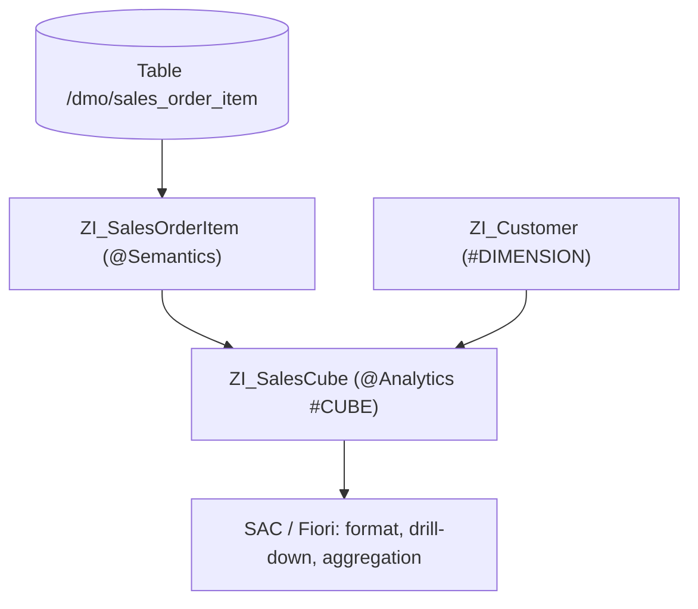

You can write a CDS that's perfect at the SQL level and still hand Fiori a `net_amount` field the tool can't tell is money, in which currency, or how to align. Semantic and analytical annotations are the contract that makes downstream tools behave on their own.

## A decimal isn't an amount

Without `@Semantics`, Fiori shows `120 1234.56 2025-06-15 USER_X`: no format, no units, no idea whether that date is technical or business. With the annotations, all of it is resolved with no UI code:

```sql
@EndUserText.label: 'Sales Order Items - Enriched'
@AccessControl.authorizationCheck: #CHECK
define view entity ZI_SalesOrderItem
  as select from /dmo/sales_order_item as Item
{
  key Item.sales_order_id,
  key Item.item_position,

      @Semantics.amount.currencyCode: 'CurrencyCode'
      Item.net_amount        as NetAmount,      // this is an amount...
      @Semantics.currencyCode: true
      Item.currency_code     as CurrencyCode,   // ...in this currency

      @Semantics.quantity.unitOfMeasure: 'QuantityUnit'
      Item.ordered_quantity  as OrderedQuantity,
      @Semantics.unitOfMeasure: true
      Item.quantity_unit     as QuantityUnit,

      @Semantics.businessDate.from: true
      Item.delivery_date     as DeliveryDate,   // business date
      @Semantics.systemDate.lastChangedAt: true
      Item.last_changed_at   as LastChangedAt   // technical timestamp
}
```

The detail that pays for itself: `systemDate.*` are "when the row was changed" timestamps, `businessDate.*` are "when the data is valid" dates. Confusing them breaks time-travel queries. And the best part is that these annotations **propagate**: if the `I_*` declares them, every `C_*` consuming it inherits them without repeating them.

## From field to cube: the analytical annotations

For reporting, the CDS stops being a table and becomes part of a star schema. That's where `@Analytics.dataCategory` comes in:

```sql
@AccessControl.authorizationCheck: #NOT_REQUIRED
@EndUserText.label: 'Sales cube'
@ObjectModel.usageType:{ serviceQuality: #X, sizeCategory: #S, dataClass: #MIXED }
@Analytics.dataCategory: #CUBE
define view entity ZI_SalesCube
  as select from ZI_SalesOrderItem
    association [0..*] to ZI_Customer as _Customer
      on _Customer.CustomerId = $projection.CustomerId
{
  key SalesOrderId,
  key ItemPosition,
      @Semantics.calendar.yearMonth: true
      PostingPeriod,
      @DefaultAggregation: #SUM
      NetAmount,
      _Customer
}
```

Two key ideas:

- **`@Analytics.dataCategory`** defines the role: `#CUBE` for facts, `#DIMENSION` for master data giving context, `#FACT` for the center without redundancy.
- **`@DefaultAggregation: #SUM`** (or `#AVG`, `#MIN`, `#MAX`, `#COUNT_DISTINCT`) tells the tool how to aggregate by default, no explicit `GROUP BY` needed: these aren't SQL aggregations, they're metadata SAC consumes.



## Fuzzy search almost for free

For consumption views with search, HANA hands you typo tolerance with three annotations:

```sql
@Search.searchable: true
define view entity ZC_CustomerSearch as select from ZI_Customer
{
  @Search.defaultSearchElement: true
  @Search.ranking: #HIGH
  @Search.fuzzinessThreshold: 0.8   // accepts ~80% similarity
  CustomerName,
  ...
}
```

A `fuzzinessThreshold` of 0.8 finds approximate matches, handy when the user types "Mueller" and the data says "Müller".

## Why this isn't optional

> Three lines of annotation on the right view save dozens of lines of UI code and manual decisions in Fiori and SAC. The alternative is each consumer reinventing formatting, currency and aggregation, badly and differently.

A well-annotated CDS doesn't just describe what data exists: it describes what it means. And that meaning is what makes the tools work for you instead of against you.
