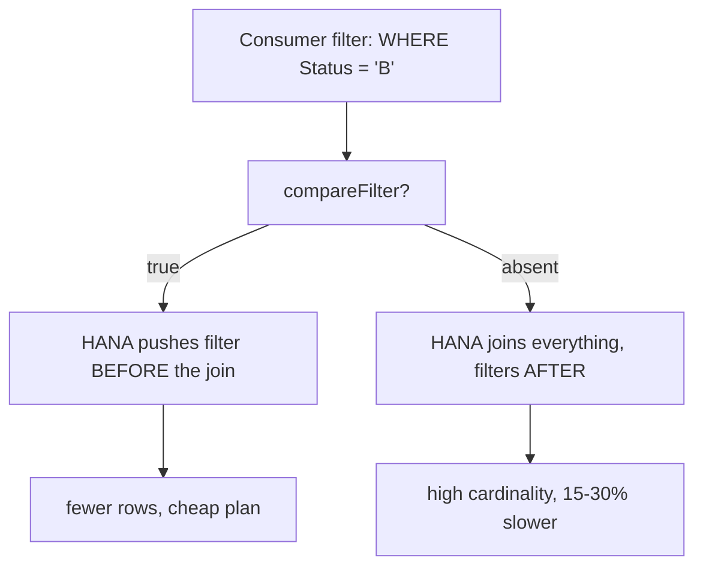

A CDS with no optimization annotations compiles the same, activates the same and runs the same on demo day. The problem shows up in production, at real volume, when the user's filter arrives late and HANA over-joins. These annotations aren't decoration: they are instructions to the compiler.

## The minimum block

Every productive read view should start with something like this:

```sql
@AbapCatalog.viewEnhancementCategory: [#NONE]
@AbapCatalog.compiler.compareFilter: true
@AccessControl.authorizationCheck: #CHECK
@ClientHandling.algorithm: #SESSION_VARIABLE
@EndUserText.label: 'Bookings with customer'
@VDM.viewType: #COMPOSITE
define view entity ZI_BookingWithCustomer
  as select from /dmo/booking as B
    inner join /dmo/customer as C on B.customer_id = C.customer_id
{
  key B.booking_id     as BookingId,
      B.booking_status as Status,
      C.last_name      as CustomerLastName
}
```

What each one does, in a sentence:

- **`compareFilter: true`**: enables pushdown of compared filters (equality, ranges, IN). Without it, the consumer's `WHERE` is applied after the joins. With it, HANA pushes it to the bottom and cuts cardinality. Forgetting it costs 15 to 30 percent on views with selective joins.
- **`authorizationCheck: #CHECK`**: evaluates the view's Access Controls (DCL). Without it, the view returns everything, unfiltered by authorization. This isn't performance: it's a data leak.
- **`clientHandling.algorithm: #SESSION_VARIABLE`**: the client filter resolves via the current SQL session, not a literal, and travels pushed down with the rest.
- **`VDM.viewType`**: declares the layer (Basic, Composite, Consumption). Doesn't speed anything up directly, but lets ATC validate architecture and documents intent.
- **`EndUserText.label`**: readable label in the catalog, OData and Fiori. Without it, your consumers see only the technical name.



## The annotation that can lie to you

`@AbapCatalog.preserveKey: true` tells the compiler the view's declared key is still unique after all joins, and enables "single record lookup" optimizations. The catch is that **CDS believes you**.

```sql
-- CORRECT: the key is still unique
@AbapCatalog.preserveKey: true
define view entity ZI_Booking
  as select from /dmo/booking
{ key booking_id, ... }

-- WRONG: the 1:N join multiplies rows, the key is NO longer unique
@AbapCatalog.preserveKey: true   -- a lie to the optimizer
define view entity ZI_BookingWithSupplements
  as select from /dmo/booking          as Booking
    inner join /dmo/booking_supplement as Supp
      on Booking.booking_id = Supp.booking_id
{ key Booking.booking_id, ... }   -- there are N supplements per booking
```

In the second case you can get lost or duplicated records in optimizations that assume uniqueness, and no error is raised.

> Declare `preserveKey: true` only if the key is genuinely still unique after the joins. When in doubt, leave it out: losing some performance beats returning wrong data without knowing.

## The code review checklist

Before approving any productive CDS: `compareFilter` present, `authorizationCheck` explicit, `clientHandling` declared, `label` non-empty, `viewType` matching the real layer, and `preserveKey` only when uniqueness is verified, not by default. Five minutes of review that pay for themselves on the first query at volume.
