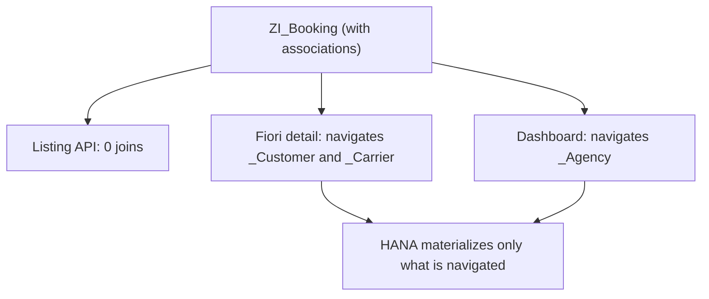

Last post we promised one thing: explaining why associations aren't syntactic sugar over joins, but a decision that changes the execution plan in HANA. Here it is, no detours.

## The difference almost nobody looks at

A **JOIN always runs**, even if your `SELECT` reads no column from the right-hand side. An **association only materializes when the consumer navigates** the path expression (`_Customer.Name`). That nuance, invisible in the editor, is what separates a view that scales from one dragging dead weight on every call.

The practical rule:

- **JOIN** when the relationship is always needed and every consumer wants it materialized.
- **Association** when the relationship is optional or selectively followed, especially if several channels consume the view with different needs.

## The case that makes it obvious

Picture a `ZI_Booking` joining `Customer`, `Carrier` and `Agency`, with three consumers: a listing API that only wants ID and status, a Fiori detail that wants everything, and a dashboard aggregating by agency. With explicit joins, all three pay all three joins:

```sql
-- Constant cost for everyone, even readers of just 3 fields
define view entity ZI_Booking_BadDesign
  as select from /dmo/booking as Booking
    inner join /dmo/customer as Customer on Booking.customer_id = Customer.customer_id
    inner join /dmo/carrier  as Carrier  on Booking.carrier_id  = Carrier.carrier_id
    inner join /dmo/agency   as Agency   on Booking.agency_id   = Agency.agency_id
{
  key Booking.booking_id     as BookingId,
      Booking.booking_status as Status,
      Customer.last_name     as CustomerLastName,
      Carrier.name           as CarrierName,
      Agency.name            as AgencyName
}
```

With associations, each consumer pays only what it navigates:

```sql
-- Cost is borne by whoever actually navigates
define view entity ZI_Booking
  as select from /dmo/booking as Booking
    association [1..1] to /dmo/customer as _Customer
      on Booking.customer_id = _Customer.customer_id
    association [1..1] to /dmo/carrier  as _Carrier
      on Booking.carrier_id  = _Carrier.carrier_id
    association [0..1] to /dmo/agency   as _Agency
      on Booking.agency_id   = _Agency.agency_id
{
  key Booking.booking_id     as BookingId,
      Booking.booking_status as Status,
      _Customer,   // exposes the association, doesn't materialize it
      _Carrier,
      _Agency
}
```

Now the listing API runs zero joins, the detail joins only Customer and Carrier, and the dashboard only Agency. In heavily reused views, this detail trims data transfer by 30 to 80 percent.



## Cardinality is not decorative

By declaring `association [min..max]` you tell the optimizer what to expect: `[1..1]` lets it assume an INNER JOIN on materialization, `[0..1]` forces LEFT OUTER, `[0..*]` serves reverse navigation. But beware:

> CDS does not verify cardinality at runtime: it only uses it for the plan. If you declare `[1..1]` and the real data has rows without a match, records can silently vanish when navigated, with no error raised.

## When the JOIN still wins

If you **always filter** by a right-hand column (not just project it), the association adds nothing: the `WHERE` forces materialization on every call. There an explicit inner join is equal or better, and more honest about what the view does.

The question isn't "association or join" by dogma. It's: "does everyone want this relationship, always?". If the answer is no, your view shouldn't force everyone to pay for it. Next post: the optimization annotations that decide whether HANA pushes your filters down or applies them too late.
