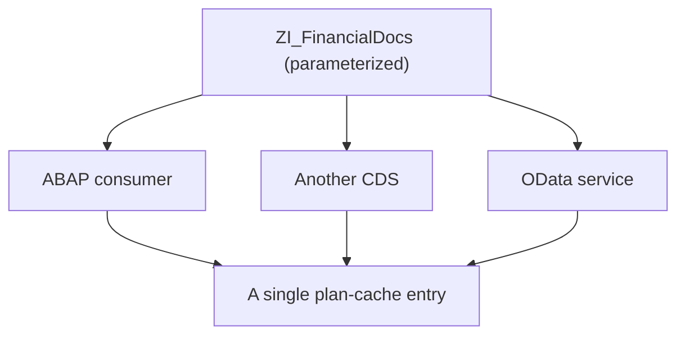

There's an anti-pattern in every reporting project: a view named `ZI_FinancialDocs_2024_ES` with the year and company code burned into the `WHERE`. It works. And the moment someone asks for another year or a new module ships, the view-cloning party begins.

## The real cost of hardcoding the filter

```sql
-- View useful only for "this year, this company"
define view entity ZI_FinancialDocs_2024_ES
  as select from I_JournalEntryItem
{ key Ledger, key CompanyCode, key FiscalYear, ... }
where FiscalYear  = '2024'
  and CompanyCode = '1010'
```

Three chained problems:

- **Not reusable.** Another year or company means a new view.
- **Explosive maintenance.** One more module? Do you clone the view twelve times?
- **Plan-cache hostile.** HANA caches by SQL literal. Each hardcoded view has its own plan and multiplies entries.

## The canonical pattern: typed parameters

```sql
@AbapCatalog.compiler.compareFilter: true
@AccessControl.authorizationCheck: #CHECK
define view entity ZI_FinancialDocs
  with parameters
    P_FiscalYear  : abap.numc(4),
    P_CompanyCode : t001-bukrs
  as select from I_JournalEntryItem
{ key Ledger, key CompanyCode, key FiscalYear, ... }
where FiscalYear  = $parameters.P_FiscalYear
  and CompanyCode = $parameters.P_CompanyCode
```

One view, reusable for any combination, with a single parameterized entry in the plan cache. And the consumer states its intent unambiguously, whatever the channel:

```abap
" From ABAP
SELECT * FROM zi_financialdocs( p_fiscalyear = @lv_year,
                                p_companycode = @lv_company )
  INTO TABLE @DATA(docs).
```

From another CDS you pass it the same way (`ZI_FinancialDocs( P_FiscalYear: '2024', P_CompanyCode: '1010' )`), and from OData the parameter travels as a key of the parameterized entity.



## The type matters more than it looks

`t001-bukrs` is not the same as `abap.char(100)`:

```sql
-- The optimizer knows the domain: 4 chars, check value
with parameters P_CompanyCode : t001-bukrs

-- The optimizer assumes the worst: 100 chars, no constraint
with parameters P_CompanyCode : abap.char(100)
```

The dictionary type affects the plan cache, conversions, the F4 value help in Fiori and the documentation. Typing it right is free and shows up everywhere.

## When NOT to use a parameter

Not every filter deserves to be one. If the view, by nature, covers only one case (a `ZI_OnlyActiveCustomers` that philosophically deals only with active customers), the `WHERE Status = 'ACTIVE'` is part of the conceptual definition, not a parameter: leaving it literal clarifies intent. And for the client there's already `@ClientHandling.algorithm`, so don't parameterize it.

## The trap: recompilation

A parameter whose cardinality varies a lot by value (filtering a small company vs one with millions of rows) can make HANA want a different plan every time.

> The symptom is `state = RECOMPILED` in `M_SQL_PLAN_CACHE`. If you see it, parameterization is helping reuse but hurting compilation. That's when you decide by hand, not by default.

Parameterizing is the rule; knowing its two exceptions is what separates who copies the pattern from who understands why it exists.
