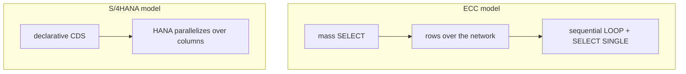

The biggest change in S/4HANA isn't the Fiori interface or the ACDOCA table. It's a principle: **logic runs where the data lives**, not the other way round. Whoever doesn't internalize that writes CDS with new syntax and an ECC mindset, then wonders why it isn't fast.

## The habit to unlearn

The classic ECC pattern was to pull data to the application server and process it there:

```abap
" ECC pattern: bring rows, process them on the AppServer
SELECT * FROM vbak INTO TABLE @DATA(orders)
  WHERE erdat IN @date_range.

LOOP AT orders INTO DATA(order).
  SELECT SINGLE name1 FROM kna1 INTO @DATA(name)
    WHERE kunnr = @order-kunnr.       " N+1 queries, the cardinal sin
  " format, compute totals...
ENDLOOP.
```

Every row travels the network, the LOOP is sequential, and the inner `SELECT SINGLE` is the classic N+1. In S/4HANA the same result is declared and executed in HANA:

```sql
-- S/4HANA pattern: logic in CDS, execution in HANA
define view entity ZI_PremiumOrders
  as select from I_SalesDocument as Order
    inner join I_Customer as Customer
      on Order.SoldToParty = Customer.Customer
{
  key Order.SalesDocument,
      Order.CreationDate,
      Customer.CustomerName,
      Order.TotalNetAmount
}
where Customer.CustomerName like '%PREMIUM%'
  and Order.CreationDate between $session.system_date - 90
                            and $session.system_date
```

One statement, parallelized by HANA, over compressed columns. In OLAP queries the difference isn't percentages: it's orders of magnitude, minutes turning into seconds.



## Three ECC reflexes you no longer need

- **Defensive `FOR ALL ENTRIES`.** It was the tool to dodge slow joins. In HANA the native join in CDS is always faster and simpler.
- **`UP TO N ROWS` as a firewall.** With well-expressed filters you rarely need an artificial limit; when you do, HANA applies it efficiently.
- **"In ABAP I have more control."** You have more surface control and worse plans: HANA's optimizer usually chooses better than you by hand.

## The detail that ruins pushdown: functions in the ON

You can have everything in CDS and still kill the plan by applying a string function in the join condition:

```sql
-- NO: padding in the ON clause, evaluated per row, the index doesn't apply
define view entity ZI_BadJoinFunctions
  as select from /dmo/booking as Booking
    inner join /dmo/customer as Customer
      on lpad( booking.customer_id, 10, '0' ) = customer.customer_id
{ ... }
```

`LPAD`, `CONCAT`, `UPPER`, `SUBSTRING` in the `ON` prevent index usage, lock out the HEX Engine and make the optimizer misjudge selectivity. Over millions of rows, a 1-second query can go to 60. The right pattern: apply the function once in a prior view and join afterwards on the derived column.

```sql
-- Basic layer: the function is applied ONCE per row
define view entity ZP_BookingPadded
  as select from /dmo/booking
{ key booking_id,
      lpad( customer_id, 10, '0' ) as PaddedCustomerId, ... }

-- Interface: pure equi-join over the already-derived column
@AbapCatalog.compiler.compareFilter: true
define view entity ZI_BookingWithCustomer
  as select from ZP_BookingPadded as Booking
    inner join /dmo/customer as Customer
      on Booking.PaddedCustomerId = Customer.customer_id
{ ... }
```

The function is evaluated N times (once per left-hand row), not N×M, HANA uses the index again and the HEX Engine kicks in.

## Where ABAP still rules

Pushdown isn't absolutism. Mass reads and transformation go to CDS; branchy decisions, side effects (writes, external calls, messages) and non-SQL algorithms (parsing, cryptography) stay in ABAP.

> The rule in one line: reads and transformation to CDS, decision and orchestration in ABAP. The rest is detail.

Writing fast CDS isn't about tricks, it's about dropping the row-by-row mindset and starting to think in sets.
