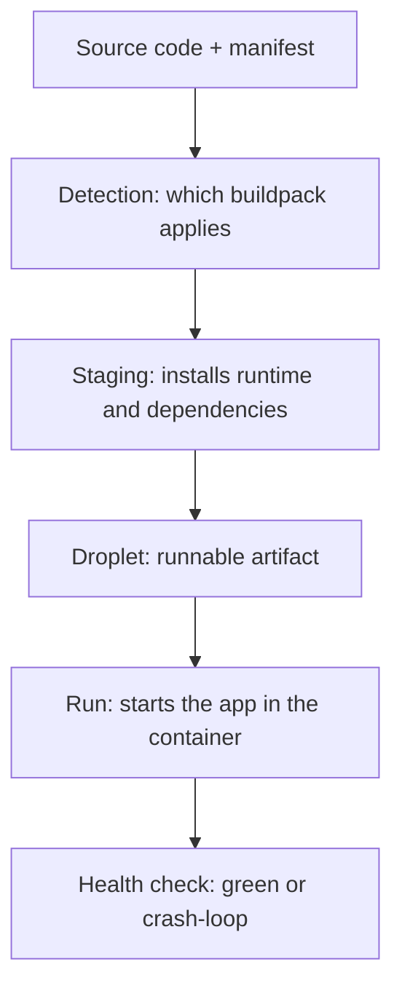

You run `cf push`, you wait, and the app starts. Between those two moments there's a phase almost nobody looks at until something fails: **staging**. It's where the buildpack takes your source code and turns it into something runnable. Understanding this phase is the difference between debugging a startup failure in two minutes or in two hours.

## What a buildpack is

A buildpack is the component that **detects your app's language, installs the runtime and dependencies, and assembles a runnable artifact** (the droplet). You don't write the buildpack: you pick one. In BTP the ones you'll touch most are `nodejs_buildpack` (for CAP services on Node and for the HDI deployer) and the Java or static-content buildpacks.

You declare it in the `mta.yaml` module or directly in `cf push`:

```yaml
modules:
  - name: projectcap-srv
    type: nodejs
    parameters:
      buildpack: nodejs_buildpack
      memory: 256M
```

## The phases: from code to droplet

The cycle has three clear moments. Staging is the middle one, and it's where almost everything breaks:



- **Detection**: the buildpack decides whether the app is its own (a `package.json` shouts "Node").
- **Staging**: installs the runtime and declared dependencies, compiles whatever needs compiling.
- **Run**: starts the droplet in a container with the assigned memory.

## Why staging memory matters

The classic Trial-account error: you assign `256M` and staging runs out of memory installing dependencies, or the app starts but enters a crash-loop because the runtime doesn't fit. The module's memory quota is not an ornament in the `mta.yaml`: **it's what decides whether staging finishes**.

```bash
# check state and memory usage
cf app projectcap-srv

# if it starts and dies, the staging log has the answer
cf logs projectcap-srv --recent
```

When staging fails, the message is almost always in those lines: a dependency that won't resolve, an incompatible Node version, or not enough memory. Don't guess: read it.

## A concrete antipattern

Packaging `node_modules` inside the artifact "to go faster". The buildpack is there to install dependencies during staging; if you feed it your own precompiled ones, you end up with mismatches between your machine and the CF container. Let the buildpack do its job: declare dependencies in `package.json`, don't carry them by hand.

> Staging is the invisible phase until it blows up. The day it blows up, you're glad you assigned memory with judgment and let the buildpack install what it's supposed to install.

Next post closes the series: deploying a full-stack CAP app end to end, putting all of the above together.
