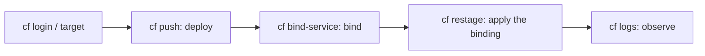

The `cf CLI` is the command-line interface that manages applications and services in Cloud Foundry. It has a huge catalog of commands, but let's be honest: **90% of your daily work is three verbs**. Deploy, bind a service and look at the logs when something breaks. The rest you look up when you need it.

## The anatomy of a cf command

Every `cf` command follows the same structure: the tool, the command, the arguments and the options. A mental model before the practice:

- **cf**: invokes the tool.
- **command**: the main action (`push`, `bind-service`, `logs`).
- **arguments**: required values, such as the app name.
- **command options**: dash-prefixed modifiers, like `-f` to force or `-t` for target.



## push: upload the application

`cf push` uploads and starts an application. You can pass parameters inline or, better, in a `manifest.yml`:

```bash
# deploy reading the directory's manifest
cf push

# or explicit: name, memory and buildpack
cf push my-app -m 256M -b nodejs_buildpack

# check the state of what's deployed
cf apps
```

## bind: connect services

An app with no data is useless. `bind-service` connects a service instance (HANA, XSUAA) to the application, injecting its credentials. The binding **does not take effect** until the app is re-prepared:

```bash
# create the service instance
cf create-service hana hdi-shared my-hdi

# bind the instance to the app
cf bind-service my-app my-hdi

# apply the binding: the app restarts with the new credentials
cf restage my-app

# list the space's services
cf services
```

The `restage` is the step everyone forgets on day one. You bind, nothing happens, and you lose half an hour before realizing the binding materializes when the app is re-prepared.

## logs: see what's really happening

When the app won't start or returns a 503, the logs are the only source of truth:

```bash
# tail the logs live
cf logs my-app

# recent dump without staying attached to the stream
cf logs my-app --recent
```

> The operator who doesn't read logs guesses. The one who guesses deploys three times what a single line of `cf logs --recent` would have solved.

Next post: what's inside `VCAP_SERVICES` and why credentials should never live in your code.
