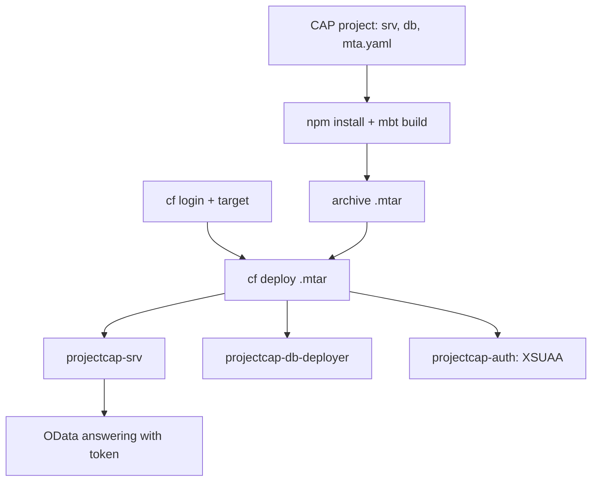

The previous five posts took the pieces apart: orgs and spaces, the `mta.yaml`, the `cf CLI`, `VCAP_SERVICES` and buildpacks. Time to put them together in the run you actually do on a project: **a full-stack CAP app, with a HANA database and XSUAA authentication, from the empty project to answering requests**.

## The CAP project

A BTP-native CAP project has a recognizable structure: `srv` (the service and CDS model), `db` (the database), and the descriptors `mta.yaml`, `package.json` and `xs-security.json`. When you create it from a template you pick the runtime (Node.js), the capabilities (**SAP HANA Cloud** and **User Authentication via XSUAA**) and the deployment target (**Cloud Foundry: MTA Deployment**).



## Step 1: dependencies and build

From the project terminal, you install dependencies and build the artifact. The `mbt build` packages the three modules into a single `.mtar`:

```bash
npm install
mbt build
# produces mta_archives/projectcap_1.0.0.mtar
```

## Step 2: log in to Cloud Foundry

The IDE doesn't know your subaccount or your space: you have to log in to the CF environment explicitly. Without this, the deploy fails:

```bash
cf login
cf target -o ORG_NAME -s dev
```

## Step 3: deploy the whole MTA

A single command deploys the three modules in order, creates the resources and resolves the bindings. No app-by-app `push`, no bindings by hand:

```bash
cf deploy mta_archives/projectcap_1.0.0.mtar
```

When it finishes, `cf deploy` returns the application URL. In the cockpit you see it in the space, under **Applications**, with `projectcap-srv` and `projectcap-db-deployer` deployed, and the **Service Bindings** to `projectcap-auth` (XSUAA) and `projectcap-db` (HANA) already resolved.

## Step 4: test the protected service

The service sits behind XSUAA, so it won't answer a bare GET: it needs an OAuth 2.0 token. You take the `clientid` and `clientsecret` from the `projectcap-auth` binding, request the token and use it against the entity:

```bash
# request a token with the XSUAA binding credentials (client credentials flow)
curl -s -X POST "$UAA_URL/oauth/token" \
  -d "grant_type=client_credentials&client_id=$CLIENT_ID&client_secret=$CLIENT_SECRET"

# call the entity with the token
curl -s "$APP_URL/odata/v4/catalog/Books" \
  -H "Authorization: Bearer $TOKEN"
```

If the HANA database is stopped, you'll get a `503`: on Trial the instances stop overnight and must be started before testing. It's the most common false failure of the whole series.

## What we avoided by doing it this way

- No credentials in the code: XSUAA and HANA arrive by binding via `VCAP_SERVICES`.
- No manual deployment order: the `mta.yaml` declares it and `cf deploy` respects it.
- The same `.mtar` serves dev, qua and prod: each space binds its own instances.

> A well-deployed CAP app isn't the one that starts on demo day. It's the one that rebuilds from the `.mtar`, with no secrets in git and no manual steps, as many times as needed.

That closes the Cloud Foundry series: from the tree of orgs and spaces to a reproducible full-stack deployment. The discipline is always the same: declare the deployment unit, let the platform inject what's sensitive, and don't guess when you can read the logs.
