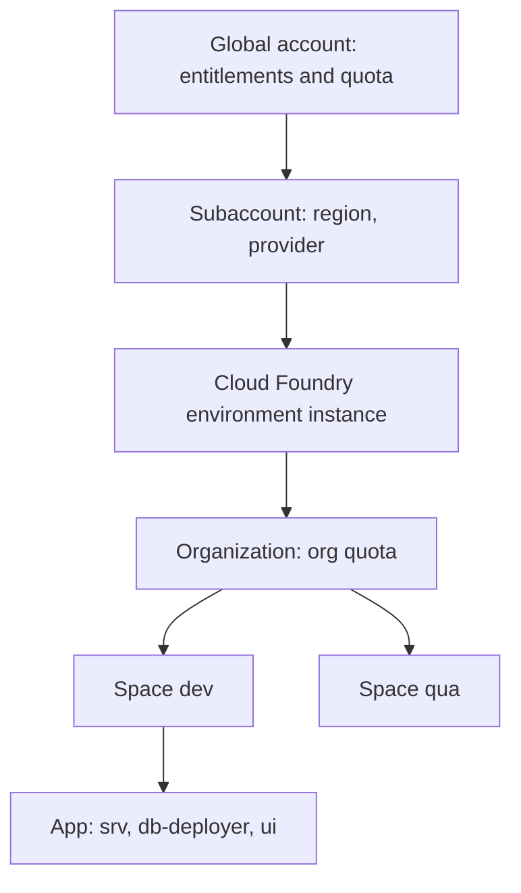

Most Cloud Foundry trouble doesn't come from `cf push`. It comes from **deploying to the wrong space, with the wrong quota, because nobody stopped to understand the hierarchy**. In SAP BTP, Cloud Foundry is not a flat drawer where you toss apps: it's a tree of containers with quota and permissions at every level.

## The hierarchy, top to bottom

- **Global account**: the contract with SAP. Entitlements and the global quotas you later distribute live here.
- **Subaccount**: the real isolation unit. It has a region, a provider (AWS, Azure) and its own services. A subaccount enables **one** Cloud Foundry environment instance.
- **Organization (org)**: inside the CF environment, it groups spaces and shares an org quota.
- **Space**: where apps actually run and service instances live. This is where you keep dev, qua and prod apart.
- **Application (app)**: your CAP service, your Fiori module, your database deployer.

The rule almost nobody writes down: **the subaccount is the boundary; the org and space are the internal organization of that boundary**. BTP CLI works up to creating the Cloud Foundry environment instance; from there on `cf` is in charge.



## Quotas are not decoration

Each level can carry a quota, and on a Trial account the caps are low. Before deploying, set an explicit space quota instead of praying it fits:

```bash
# Space quota: memory per instance, total memory, routes, services, app instances
cf create-space-quota quota_q -i 8192M -m 4096M -r 10 -s 400 -a 20

# Create the space and attach the quota
cf create-space space_qua -o ORG_NAME -q quota_q
```

If you have several organizations, target the right one before touching anything. This is the classic mistake: deploying into another project's org because the `target` pointed elsewhere.

```bash
cf login
cf target -o ORG_NAME -s space_qua
```

## The mistake you'll see in every project

The whole team deploying into the same space, with no separation between dev and prod, and finding out about it when a test knocks down the app that was in the demo. Isolation is not optional: **one space per lifecycle stage**, and a quota to back it.

> A good `cf push` starts three steps earlier: the right subaccount, the right org, the space with its quota. The rest is typing an app name.

Next post: the MTA descriptor and why the unit of deployment is not the app, it's the `mta.yaml`.
