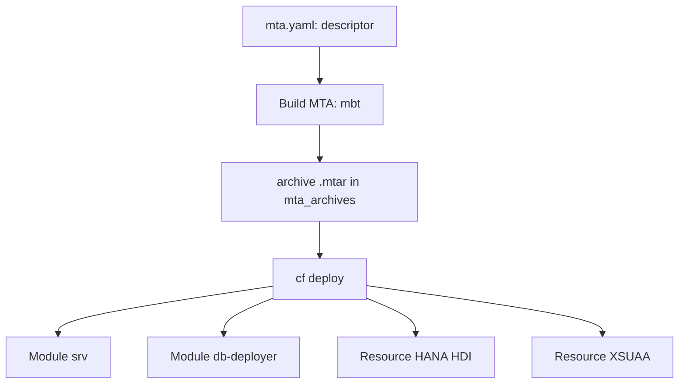

You can deploy a standalone app with `cf push` and be happy. The trouble starts when your application is **three modules that depend on each other**: a CAP service, a HANA database deployer and a UI layer. There, `cf push` one by one forces you to remember the order, the dependencies and the bindings by hand. The Multi-Target Application (MTA) exists so you don't have to remember any of that.

## What an MTA really is

An MTA is **a single deployable artifact** (`.mtar`) that packages all the application's modules and resources, with their dependencies declared. The descriptor is `mta.yaml`, and it defines four blocks that matter:

- **modules**: the components that get deployed (`srv` service, `db-deployer`, `ui`).
- **resources**: the services the application needs (HANA HDI, XSUAA).
- **requires / provides**: the wiring between modules and resources.
- **build-parameters / buildpacks**: how each module is compiled and packaged.

The opinion, plainly: **in BTP the unit of deployment is not the app, it's the MTA**. You version `mta.yaml`, and the full deployment is reproducible. A raw `cf push` is convenient for a test; for a project it's debt.



## A minimal but honest descriptor

Notice how the `srv` module **requires** the resources, and how each module declares its `buildpack` and its memory quota:

```yaml
_schema-version: "3.1"
ID: projectcap
version: 1.0.0
modules:
  - name: projectcap-srv
    type: nodejs
    path: gen/srv
    parameters:
      buildpack: nodejs_buildpack
      memory: 256M
      disk-quota: 256M
    requires:
      - name: projectcap-db
      - name: projectcap-auth
  - name: projectcap-db-deployer
    type: hdb
    path: gen/db
    parameters:
      buildpack: nodejs_buildpack
      memory: 256M
    requires:
      - name: projectcap-db
resources:
  - name: projectcap-db
    type: com.sap.xs.hdi-container
  - name: projectcap-auth
    type: org.cloudfoundry.managed-service
    parameters:
      service: xsuaa
      service-plan: application
```

## From descriptor to artifact

The build turns the project into the `.mtar`. In SAP Business Application Studio it's a right-click on `mta.yaml` and **Build MTA Project**; on the terminal it's the `mbt` tool:

```bash
# install project dependencies
npm install

# build the .mtar artifact into mta_archives/
mbt build

# deploy the whole artifact, in order and with bindings resolved
cf deploy mta_archives/projectcap_1.0.0.mtar
```

That `cf deploy` does what `cf push` won't: it creates the resources, respects the dependency order and binds the services before starting the modules.

> Writing the `mta.yaml` costs you half an hour the first time. Rebuilding a three-module deployment by hand costs you an afternoon every time something changes.

Next post we get into the `cf CLI`: `push`, `bind` and `logs`, the three you use every day.
