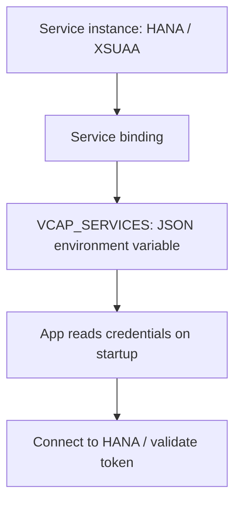

There's an antipattern that keeps showing up in BTP projects: the `clientID`, the `clientSecret` and the HANA connection string written into a config file in the repository. In Cloud Foundry that isn't just insecure: it's **unnecessary**. The platform injects those credentials at runtime through `VCAP_SERVICES`. Your code reads them from there; it doesn't know them in advance.

## How binding works at runtime

When you bind a service to an app (`cf bind-service`), Cloud Foundry copies nothing into your code. What it does, when the app starts, is **populate a JSON environment variable** called `VCAP_SERVICES` with the credentials of every bound service. The app reads it on startup.

- **Service instance**: HANA HDI, XSUAA, a database.
- **Service binding**: the link between the instance and the app.
- **VCAP_SERVICES**: the JSON the platform injects with the binding's credentials.



## What's inside VCAP_SERVICES

A look at the content clears it all up. Each bound service appears with its credentials under its type:

```json
{
  "hana": [
    {
      "name": "projectcap-db",
      "credentials": {
        "host": "xxxxx.hana.prod-us10.hanacloud.ondemand.com",
        "port": "443",
        "user": "DBADMIN_...",
        "password": "..."
      }
    }
  ],
  "xsuaa": [
    {
      "name": "projectcap-auth",
      "credentials": {
        "clientid": "sb-projectcap!t123",
        "clientsecret": "...",
        "url": "https://subaccount.authentication.us10.hana.ondemand.com"
      }
    }
  ]
}
```

That XSUAA `clientid` and `clientsecret` are the same ones you'd see in the cockpit under **Service Bindings / Show sensitive data**. The difference is that here they arrive on their own, without anyone typing them.

## Reading it without parsing by hand

You could do `JSON.parse(process.env.VCAP_SERVICES)`, but it's fragile. In CAP the runtime already resolves the binding for you; for everything else there's `xsenv`, which locates the service by its label or name:

```javascript
const xsenv = require("@sap/xsenv");

// load and locate the xsuaa binding by its label
const services = xsenv.getServices({ uaa: { label: "xsuaa" } });
const { clientid, clientsecret, url } = services.uaa;

// credentials come from the environment, never from the repository
```

Inspecting the injected environment from the CLI also helps when debugging:

```bash
cf env my-app
```

## Why this is an architecture decision, not a trick

If your code reads credentials from `VCAP_SERVICES`, the same artifact works in dev, qua and prod **without touching a line**: each space binds its own HANA instance and its own XSUAA. If instead you write them into the repository, you've coupled the code to a specific environment and put a secret into git.

> Typed credentials leak. Injected ones live and die with the binding, and the same `.mtar` serves all three environments.

Next post: buildpacks and staging, what happens between your `cf push` and a running app.
