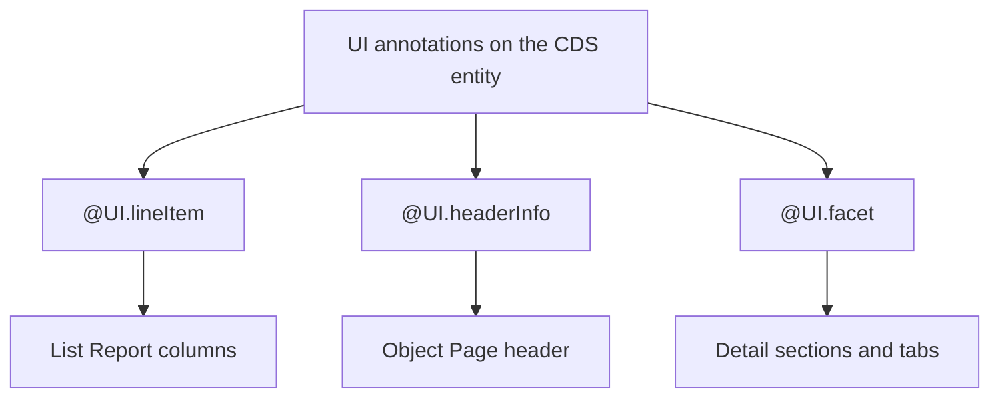

If Fiori Elements generates the UI from metadata, those UI annotations are the language you speak to the framework with. There aren't many, and mastering three or four takes you far. Let's go to the ones that structure any List Report + Object Page.

## The three you need to master

- **`@UI.lineItem`**: defines the list columns. Each element is a column, with its position and importance (when it shows depending on screen size).
- **`@UI.headerInfo`**: defines the Object Page header. Title, subtitle, object type (singular and plural) and image.
- **`@UI.facet`**: organizes the Object Page body into sections and tabs, each referencing a field group, a data point or a table.



## Header: headerInfo

The Object Page header is not laid out, it is declared. You tell it the object name and which fields are the title and the description:

```cds
UI.HeaderInfo : {
    TypeName       : 'Product',
    TypeNamePlural : 'Products',
    ImageUrl       : ImageUrl,
    Title          : {Value : ProductName},
    Description    : {Value : Description}
}
```

`TypeName` and `TypeNamePlural` are what Fiori shows when viewing one or several records. `ImageUrl` paints the header image. Not a line of UI code.

## Detail: facets that organize

An empty Object Page is useless. The `facet` items fill it with sections. Each `ReferenceFacet` points to another annotation (a field group, a data point) and becomes a tab or section:

```cds
UI.Facets : [
    {
        $Type  : 'UI.ReferenceFacet',
        ID     : 'GeneralInfo',
        Label  : 'General Information',
        Target : '@UI.FieldGroup#GeneratedGroup1'
    }
]
```

The `Target` is the key: the facet doesn't contain fields, it references a grouping declared apart. That way you separate "which fields go together" from "how they are laid out in the detail". You change one without touching the other.

## The detail that makes the difference

Positions. The habit in the metadata extensions model is to start at 10 and go in tens:

- If you start at 1, 2, 3 and then need to insert a column between 2 and 3, you have to renumber everything.
- If you start at 10, 20, 30, you always have room (15, 25) to insert without touching the rest.

It's a silly detail that saves you whole rewrites six months from now, when the business asks for "one more column, right there".

> UI annotations are declarative: you describe the result, not the process. That is what makes a Fiori Elements app read like a specification and not a tangle of callbacks.

Next post: draft and actions, the behavior that brings these screens to life.
