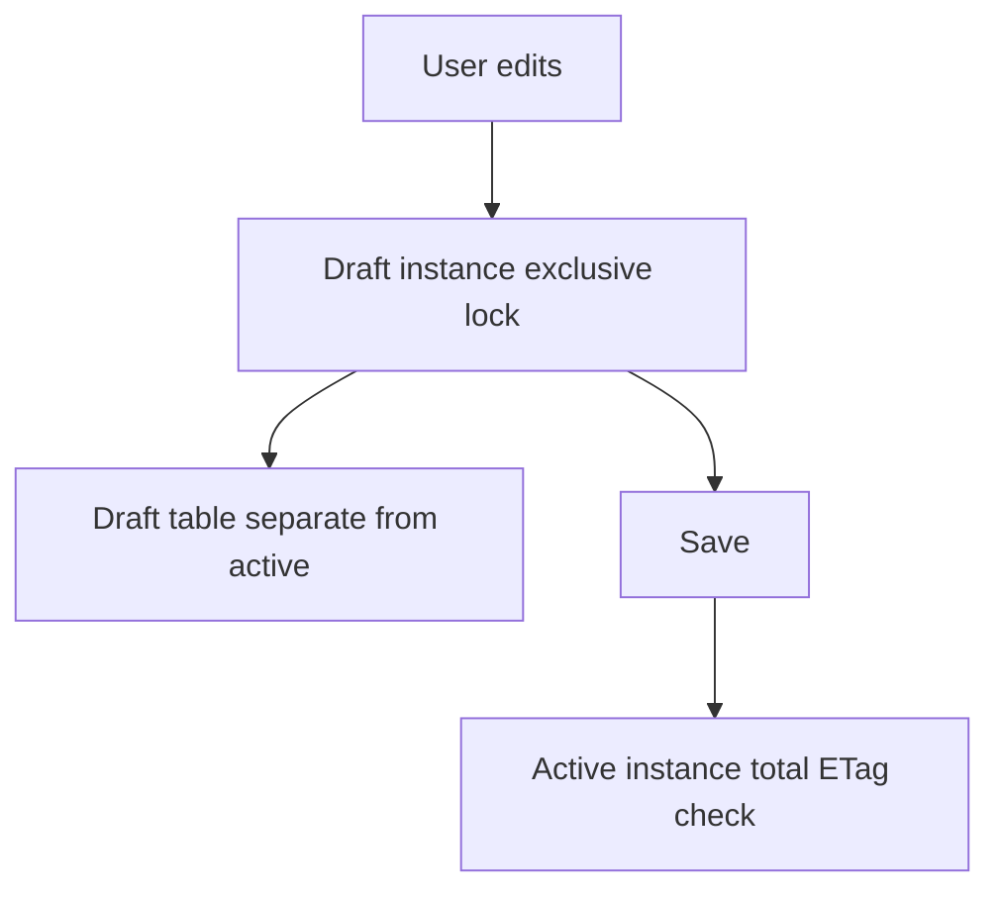

Showing data is the easy half. What turns a Fiori Elements app into a real business application is letting the user edit safely and run operations. Two pieces do that work: **draft** and **actions**. And, true to the Fiori Elements spirit, neither is coded in the UI.

## Draft: editing without fear of losing work

Draft gives the end user flexibility: they can start editing a record, leave it half done and come back later, without having touched the active data yet. In RAP, draft is declared in the behavior definition of the business object, not in the screen.

Details that matter about the draft model:

- **It is exclusive per user**: a draft belongs to whoever created it. Only that user sees and processes it. As soon as they start working, they set an exclusive lock.
- **It lives in its own table**: draft instances are stored apart from active ones, in a separate draft table generated from the behavior definition.
- **Never accessed via direct SQL**: access to the draft table always goes through EML, so the draft metadata stays consistent.
- **Total ETag for concurrency**: a designated field checks concurrency when moving from draft to active, avoiding overwriting someone else's changes.



## Actions: buttons that call ABAP logic

An action is a button in the bar that runs an operation. In Fiori Elements the button is declared with an annotation, and that annotation references an ABAP method of the business object:

```cds
UI.LineItem : [
    {
        $Type      : 'UI.DataFieldForAction',
        Label      : 'Approve',
        Action     : 'com.logalitech.service.approve'
    }
]
```

In the RAP model with metadata extensions, the same button is declared with `type: #FOR_ACTION` and a `dataAction` pointing to the method implemented in the behavior class. The UI doesn't contain the logic: it invokes it.

The elegant part is that you can replicate the same button in the list and in the Object Page just by changing where you declare it. And the framework decides when to enable it: the create action is always available, delete activates when a row is selected, and with RAP feature control you can dynamically disable a button depending on the record state.

## The anti-pattern

Putting business logic in the frontend because "it's faster". The day another app or an API needs that same operation, the logic is trapped in JavaScript. With actions declared on the business object, the operation lives in the backend and any consumer reuses it.

> Draft and actions are the acid test of Fiori Elements: complex behavior that stays declarative. If you find yourself writing a controller to handle a save, stop and ask whether the business model shouldn't be doing it for you.

Next post: extension points, when stepping out of the lane is truly justified.
