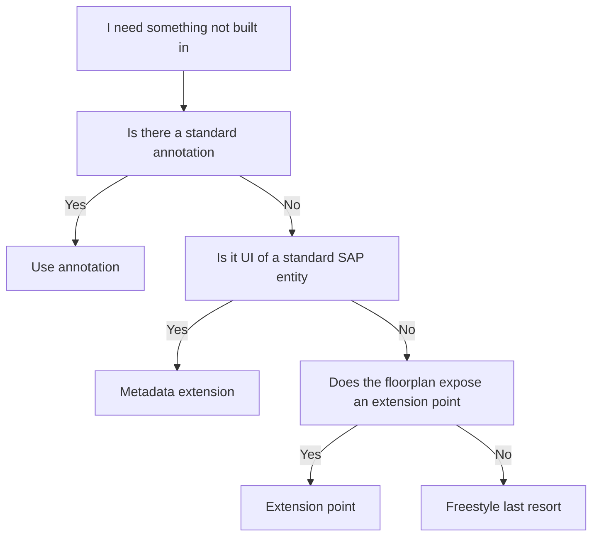

Fiori Elements solves 80% of the screen without writing code. The other 20% is the trap: when the framework doesn't do exactly what you want, the temptation is to reach for hand-written code and break everything you gained. **Extension points** are the exit designed for that. The key is to use them as an exception, not a rule.

## The "how do I get it" hierarchy

Before writing a line of UI5, climb this ladder from lowest to highest cost:

1. **Standard annotation**: is there a UI annotation that already does what you want? Almost always yes. Start here.
2. **Metadata extension**: if you need to tweak the UI of a standard SAP entity without touching it, you extend its metadata extension. It is the canonical way and respects Clean Core.
3. **Floorplan extension point**: if you need a client-computed column, a button with custom logic or a bespoke section, that is what the extension points the floorplan exposes are for.
4. **Freestyle**: only if none of the above fits. And then question whether Fiori Elements was the right pattern.



## Why metadata extensions come first

They separate UI annotations from the CDS body. The entity stays focused on the data model; annotations live in separate files with layers: `#CORE` is SAP's base, `#CUSTOMER` is yours and always wins. Extending a standard metadata extension doesn't touch the original CDS:

```cds
@Metadata.layer: #CUSTOMER
annotate entity I_Product with
{
  @UI.lineItem: [{ position: 90, importance: #HIGH, label: 'Custom Field' }]
  MyCustomField;
}
```

That `#CUSTOMER` layer overlays the standard without modifying it. On upgrade day, SAP changes its `#CORE` layer and yours stays intact. That's Clean Core applied to the UI: you extend without modifying.

## The real cost of skipping the hierarchy

A freestyle extension point written because you didn't look for the equivalent annotation is pure technical debt. It works on demo day and becomes the fragile point of the next upgrade. Multiply it by every screen that "was in a hurry" and you have a Fiori Elements project that is no longer declarative: it's freestyle in disguise.

The right question before every extension point is not "can I?", but "**is this the cheapest layer where it can be solved?**".

> Stepping out of the Fiori Elements lane is not a failure: it's an architecture decision. What is a failure is stepping out without checking whether the lane already took you where you wanted to go.

Next post: Fiori tools in VS Code, the tooling that makes all of this productive.
