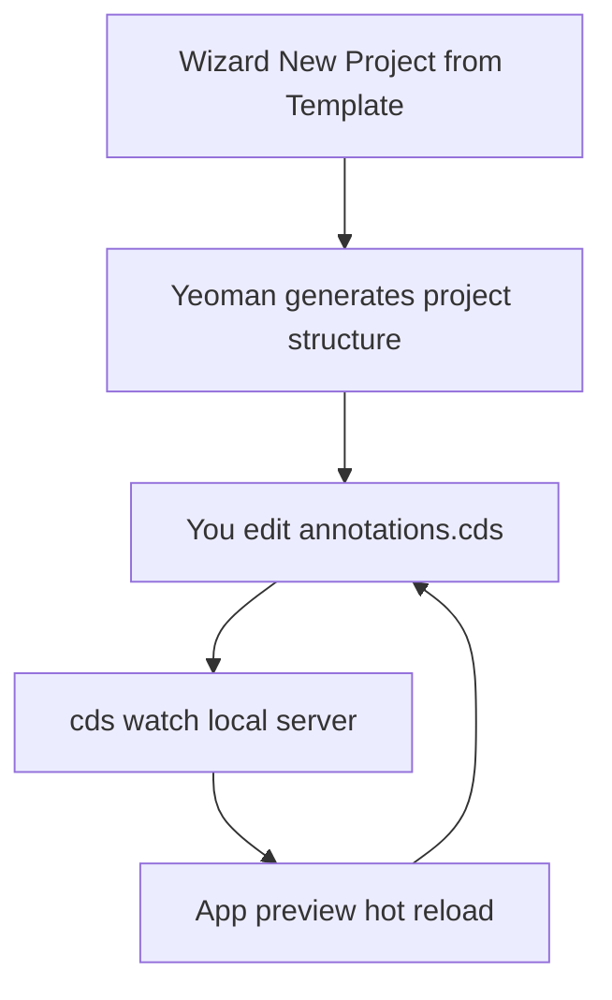

Fiori Elements without good tooling would be writing annotations blindly in a text file. **Fiori tools** (available both in VS Code and in SAP Business Application Studio, which is VS Code in the cloud) are what turn that declarative model into something productive. It's not optional: it's the difference between hours and minutes.

## What they really give you

- **The generation wizard**: "New Project from Template" starts a Fiori Elements project, asks you for the floorplan, connects the OData data source and lets you choose the main entity and the navigation one. In minutes you have the full structure.
- **The command palette**: with Ctrl+Shift+P you reach every common operation without memorizing commands.
- **Yeoman underneath**: the template-based project generator avoids building everything from scratch and minimizes startup errors.
- **Hot reload**: in a CAP project, `cds watch` starts the local server and refreshes the app as soon as you change an annotation. You see the effect instantly.



## The real startup flow

After generating the project, the `app` folder contains the Fiori Elements app. In the CAP project, the `service.cds` file references the annotations file the wizard already left ready:

```cds
using MyService as service from '../../srv/service';
annotate service.Products with @(
    UI.LineItem : [
        { $Type : 'UI.DataField', Value : ProductName },
        { $Type : 'UI.DataField', Value : Price }
    ]
);
```

You run `cds watch`, the local server starts, and among the endpoints appears the web application that is your Fiori Elements app over the entity. You edit the annotation, save, and the preview updates without restarting anything.

## The mistake you'll see

Writing annotations by hand in a plain text editor because "that way I understand better what I'm doing". You understand better on day one and lose productivity for the rest of the project. The tooling doesn't hide the annotations from you: it autocompletes them, validates the syntax and shows you the effect live. Rejecting it is craftsmanship misunderstood.

And the opposite: leaning so much on the wizard that you don't know which annotation it generated or why. The tooling speeds you up, but you still have to read and understand the annotations, because those are what you'll maintain.

> Good tooling doesn't replace knowing what each annotation does: it makes it fast. Fiori Elements is declarative, and declarative asks for an editor that shows you the result while you type, not after you deploy.

This closes the Fiori Elements series: what they are, their floorplans, UI annotations, draft and actions, extension points and the tooling that makes it all bearable.
