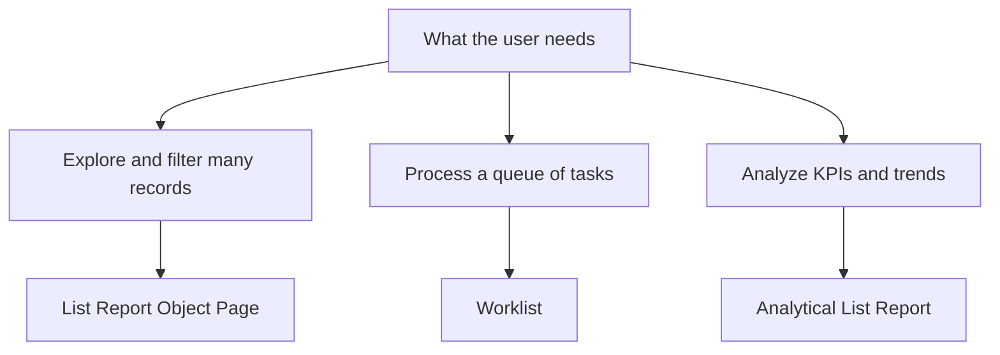

A floorplan is a screen template with predefined behavior. Fiori Elements gives you several, and most projects always use the same one out of inertia. Picking the right floorplan up front saves you from fighting the framework later.

## The ones you'll actually use

- **List Report + Object Page**: the workhorse. A list with a filter bar on top and, when you click a row, a detail page (Object Page) with header, sections and tabs. 80% of transactional apps are this.
- **Worklist**: like the List Report but without the elaborate filter bar. Built for "here is your list of pending tasks, work through them". Less exploration, more direct action.
- **Analytical List Report**: the same list structure but with visualizations (KPIs, charts) and aggregations. It needs an analytical model behind it, not just a transactional entity.
- **Overview Page**: a card dashboard to give context and navigate. It is a case apart: not "list and edit", but "summarize and jump".



## How you pick in practice

You don't pick it by hand in a file: you pick it in the wizard. In SAP Business Application Studio, through "New Project from Template" you start a Fiori Elements project and the generator (Yeoman) asks you for the floorplan. For the most common case you pick **List Report Object Page**, connect the OData data source and select the main entity and the navigation entity.

That wizard generates the project structure under the `app` folder, and there the annotations file you'll fill in already appears:

```cds
UI.SelectionFields : [
    ToCategory_ID,
    ToCurrency_ID,
    StockAvailability
]
```

Those `SelectionFields` are the List Report filter bar. In a Worklist you'd drop them; in the analytical one you'd combine them with visualizations. The floorplan dictates which annotations make sense.

## The classic mistake

Picking List Report Object Page for everything, even when the user just wants to process a work queue. You end up with a filter bar nobody touches and an overloaded Object Page. If the interaction is "see the list, act, next", a Worklist fits better and with less configuration.

And the other way round: forcing a List Report to show KPIs with charts when you actually wanted an analytical one. Without the analytical model behind it, you end up fighting the framework to make it do what isn't its pattern.

> The right floorplan is not the one that can do the most: it's the one that does exactly what your user needs, without you having to switch off half of its features.

Next post: the UI annotations that shape those screens.
