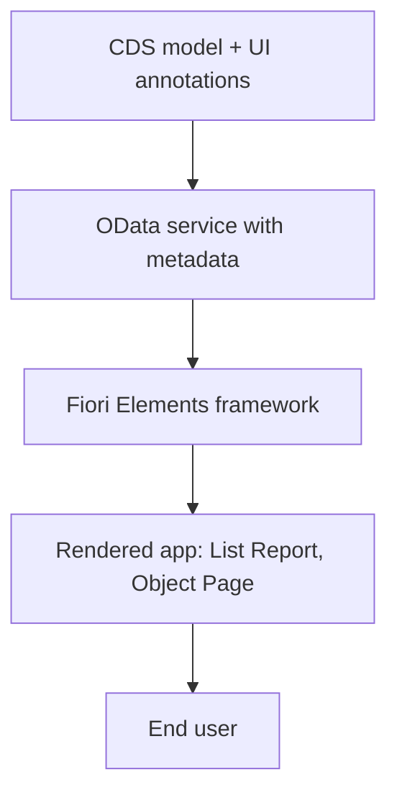

The first time someone sees a Fiori Elements app running they usually ask the same thing: "where is the screen code?". There isn't any, or almost none. And that is exactly the point. **Fiori Elements generates the interface from metadata, not from hand-written XML views.**

## The paradigm shift

In freestyle SAPUI5 you write the view, the controller, the binding, the routing and the formatting. Every screen is your code, and all of that code is yours to maintain for years.

In Fiori Elements the app is a template (a floorplan) filled in at runtime by reading the OData service and its **UI annotations**. You don't describe how to paint a table: you describe which fields make up a line, and the framework paints it.

- **Less code of your own**: no controller to maintain for 80% of cases.
- **Consistent UX by default**: filters, sorting, export to Excel, column personalization, all solved and identical across apps.
- **The UI lives close to the data**: annotations are declared on the CDS entity, not scattered across JavaScript files.



## A concrete example

This is what you "program" to make a column appear in the products list. It is an annotation, not a view:

```cds
UI.LineItem : [
    {
        $Type : 'UI.DataField',
        Label : 'ProductName',
        Value : ProductName
    },
    {
        $Type : 'UI.DataField',
        Label : 'Price',
        Value : Price
    }
]
```

With those lines you already have sortable, filterable and exportable columns. You haven't touched a single line of UI5.

Notice three things that pay off:

1. `$Type: 'UI.DataField'` tells the framework this is a normal data field; there are other types for actions, images or data points.
2. `Value` references the model element, not a hardcoded label: change the CDS and the UI follows.
3. There are no pixel coordinates or CSS: the responsive layout is decided by the floorplan.

## When it is NOT the answer

Let's be honest: Fiori Elements shines in the "list, filter, view detail, edit" pattern. If your app is a drag and drop configurator, a heavily visual dashboard or a bespoke experience, freestyle is still the way. The healthy rule is to start with Elements and step out of the lane only when the case truly demands it.

> Every line of UI5 you don't write is a line you don't have to maintain in the next upgrade. Fiori Elements turns screens into metadata, and metadata ages far better than JavaScript.

Next post: the available floorplans and when to pick each one.
