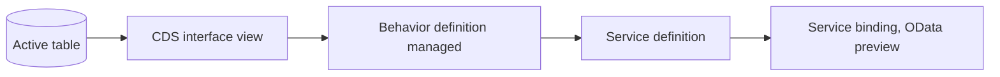

You have already read about the data model, about managed versus unmanaged, about EML. And even so, the first time you sit down to create a RAP business object from scratch, the question is still the same: where exactly do I start? This walkthrough answers that with a single real piece, end to end: a table, a CDS interface view and a managed behavior definition. Nothing more, nothing less than what is needed to have something that compiles, activates and responds in the service preview.

The object we are going to build is deliberately small: a record of internal requests (`zin_deal`), with an identifier, a customer, an amount and a status. It does not solve any real business case yet, but it brings exactly the shape that RAP expects, and that is what matters in a first walkthrough.

If you already know any of these pieces separately, the posts in this same category go into detail on each one: [the complete data model](/en/blog/rap-modelo-de-datos/), [managed versus unmanaged](/en/blog/rap-managed-unmanaged/), [validations and determinations](/en/blog/rap-validaciones-determinaciones/), [draft mode](/en/blog/rap-draft/), [authorizations](/en/blog/rap-autorizaciones/) and [EML](/en/blog/rap-eml/). Here the goal is different: to see them all fit together, just once, in order.



## Step 1: the active persistence table

Every RAP business object starts with a database table with annotations, not in the SAP GUI graphical editor. For the managed scenario, the framework expects a client, a UUID key and the standard audit columns.

```cds
@EndUserText.label: 'Solicitud interna'
@AbapCatalog.enhancement.category: #NOT_EXTENSIBLE
@AbapCatalog.tableCategory: #TRANSPARENT
@AbapCatalog.deliveryClass: #A
define table zin_deal {
  key client            : abap.clnt not null;
  key deal_uuid          : sysuuid_x16 not null;
  customer_id           : /dmo/customer_id;
  @Semantics.amount.currencyCode: 'currency_code'
  net_amount            : /dmo/total_price;
  currency_code         : /dmo/currency_code;
  status                : zin_deal_status;
  local_created_by      : abp_creation_user;
  local_created_at      : abp_creation_tstmpl;
  local_last_changed_by : abp_locinst_lastchange_user;
  local_last_changed_at : abp_locinst_lastchange_tstmpl;
  last_changed_at       : abp_lastchange_tstmpl;
}
```

A detail that comes up on every first attempt: the key is a UUID, not a sequential number that you generate. Let the framework handle it; it is one of the things managed gives you for free, and jumping ahead to solve it by hand is the most common way to break automatic generation later on.

## Step 2: the CDS interface view

An interface view is defined on top of the table, the layer that RAP uses as the semantic contract of the business object. This is where you declare the semantic key, the text associated with each field, and which view is the root.

```cds
@AccessControl.authorizationCheck: #CHECK
@EndUserText.label: 'Solicitud interna, vista de interfaz'
@ObjectModel.dataCategory: #TRANSACTIONAL
define root view entity ZI_Deal
  as select from zin_deal
{
  key deal_uuid          as DealUUID,
  customer_id            as CustomerId,
  @Semantics.amount.currencyCode: 'CurrencyCode'
  net_amount             as NetAmount,
  currency_code          as CurrencyCode,
  status                 as Status,
  @Semantics.user.createdBy: true
  local_created_by       as LocalCreatedBy,
  @Semantics.systemDateTime.createdAt: true
  local_created_at       as LocalCreatedAt,
  @Semantics.user.localInstanceLastChangedBy: true
  local_last_changed_by  as LocalLastChangedBy,
  @Semantics.systemDateTime.localInstanceLastChangedAt: true
  local_last_changed_at  as LocalLastChangedAt,
  @Semantics.systemDateTime.lastChangedAt: true
  last_changed_at        as LastChangedAt
}
```

Two annotations that get overlooked on a first attempt and then cost you an afternoon of debugging: `@ObjectModel.dataCategory: #TRANSACTIONAL` is what tells the framework that this view is a candidate for a business object, and without the audit semantics (`@Semantics.user.*`, `@Semantics.systemDateTime.*`) mapped one to one with the table, the behavior definition in the next step will not compile.

One data element that the table from Step 1 already takes for granted is missing: `zin_deal_status`. It is defined separately, as a `abap.char(10)` with fixed values, before activating the table:

```cds
@EndUserText.label: 'Estado de la solicitud'
@AbapCatalog.enhancement.category: #NOT_EXTENSIBLE
define type zin_deal_status : abap.char(10);
```

For this first walkthrough you do not need a domain with fixed values or a value help; that fits better in the post about [validations and determinations](/en/blog/rap-validaciones-determinaciones/), where there is already logic that decides which statuses are valid.

## Step 3: the managed behavior definition

With the table and the interface view active, the next file is the behavior definition. It is what turns a CDS view into something an OData client can create, update and delete with.

```abap
managed implementation in class zbp_i_deal unique;
strict 2;

define behavior for ZI_Deal alias Deal
  persistent table zin_deal
  lock master
  authorization master ( instance )
  etag master local_last_changed_at
{
  create;
  update;
  delete;

  field ( readonly ) DealUUID, LocalCreatedBy, LocalCreatedAt, LocalLastChangedBy, LocalLastChangedAt, LastChangedAt;

  mapping for zin_deal
  {
    DealUUID              = deal_uuid;
    CustomerId             = customer_id;
    NetAmount               = net_amount;
    CurrencyCode           = currency_code;
    Status                 = status;
    LocalCreatedBy         = local_created_by;
    LocalCreatedAt         = local_created_at;
    LocalLastChangedBy     = local_last_changed_by;
    LocalLastChangedAt     = local_last_changed_at;
    LastChangedAt          = last_changed_at;
  }
}
```

There is not a single line of custom ABAP code here yet; `create`, `update` and `delete` with no body are the promise that the framework takes care of persistence for you. That is exactly what managed means: you declare the contract, and saving, optimistic locking (`etag master`) and UUID generation are handled by RAP. The class `zbp_i_deal` must be created empty (the compiler already asks for it with `unique`), but it does not need a single line inside for this walkthrough to work.

## Step 4: service definition, service binding and preview

The last thing missing is exposing the interface view as an OData service that can be tested.

```cds
@EndUserText.label: 'Solicitudes internas'
define service definition ZI_DEAL_O4 {
  expose ZI_Deal as Deal;
}
```

The service binding is created on top of that definition, type OData V4, category UI. A click on "Publish" registers the service, and "Preview" opens a generic Fiori Elements list, generated without a single line of UI annotation. There you can create an internal request, save it and see it appear in the list, with the `DealUUID` already resolved by the framework.

## What you end up with in your RAP business object, and what comes next

With these four pieces active, `ZI_Deal` is already a complete RAP business object in its simplest form: create, read, update and delete working from the preview, without a single line of business logic of its own. It is deliberately little. What naturally follows from here is not a new feature, but the pieces this same object is missing to get closer to something real: [validations and determinations](/en/blog/rap-validaciones-determinaciones/) so that the state has rules, [draft mode](/en/blog/rap-draft/) so that a user can save halfway, and [authorizations](/en/blog/rap-autorizaciones/) so that not just anyone can touch someone else's request. All three start from exactly this same `zin_deal`.

If this first walkthrough left you wanting to see the same pattern applied to a real business case and not to a four-field example, the book [ABAP Cloud: Business Applications with RAP](/books/abap-rap) builds a complete sales order application with the same approach, case by case. And if you prefer the guided walkthrough with assessment, the course [SAP ABAP RAP: Cloud Architecture](/courses/sap-abap-rap-arquitectura-cloud/) covers the same ground with exercises on a real S/4HANA system.
