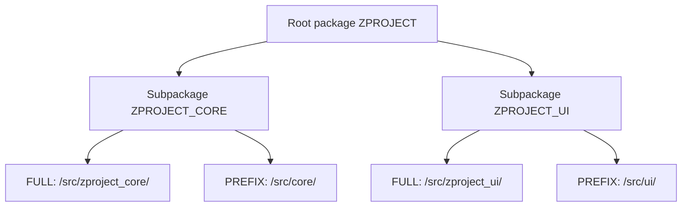

When you do your first push with abapGit, a discreet file appears at the repository root: `.abapgit.xml`. Most people ignore it until a pull imports objects into the wrong package. Then they discover, too late, that this file **is the contract between your ABAP package hierarchy and the repo's folder structure**.

## What it contains

The `.abapgit.xml` holds the repository configuration. Its key fields:

```xml
<?xml version="1.0" encoding="utf-8"?>
<abapGit version="v1.0.0">
 <asx:abap xmlns:asx="http://www.sap.com/abapxml">
  <asx:values>
   <DATA>
    <MASTER_LANGUAGE>E</MASTER_LANGUAGE>
    <STARTING_FOLDER>/src/</STARTING_FOLDER>
    <FOLDER_LOGIC>FULL</FOLDER_LOGIC>
    <IGNORE>
     <item>/.gitignore</item>
     <item>/README.md</item>
    </IGNORE>
   </DATA>
  </asx:values>
 </asx:abap>
</abapGit>
```

- **MASTER_LANGUAGE**: the master language of the texts. Set it right from the start; changing it later is painful.
- **STARTING_FOLDER**: the folder where the code lives, almost always `/src/`.
- **FOLDER_LOGIC**: how packages map to folders. It's the field that decides everything.
- **IGNORE**: file patterns abapGit leaves alone.

## FULL vs PREFIX: the decision that matters

When you link a package, abapGit asks you about the folder logic. There are two options and they aren't casually interchangeable:

- **FULL**: accepts any subpackage name. The folder structure reflects the real package hierarchy as is.
- **PREFIX**: requires every subpackage to carry the main package name as a prefix. Folders use only the leftover part after the prefix, so they come out shorter.



My practical recommendation: **FULL by default**. It's the option abapGit suggests and the least surprising, because the folder name matches the real package name. PREFIX only pays off if your naming convention is so strict that the prefix repeated in every folder becomes pure noise.

## Why this bites you

The classic pain scenario: you link a repo with FOLDER_LOGIC FULL in the source system, and in the target you try to pull expecting a different package structure. If the mapping doesn't line up with the packages that exist, either abapGit creates packages you didn't want or the pull fails.

- The `.abapgit.xml` **travels with the repo**, not with the system. Whoever pulls inherits your decision.
- Changing FOLDER_LOGIC mid-project reshuffles every folder: one giant, noisy commit.

> The `.abapgit.xml` is not decorative metadata. It's the map that translates packages to folders. Decide it once, when you create the repo, and don't touch it unless you know exactly which reorganization you're triggering.

Final tip: set MASTER_LANGUAGE and FOLDER_LOGIC in the first commit, check that STARTING_FOLDER is `/src/`, and leave that file alone. It's one of the few things in abapGit where "configure and forget" is the right answer.
